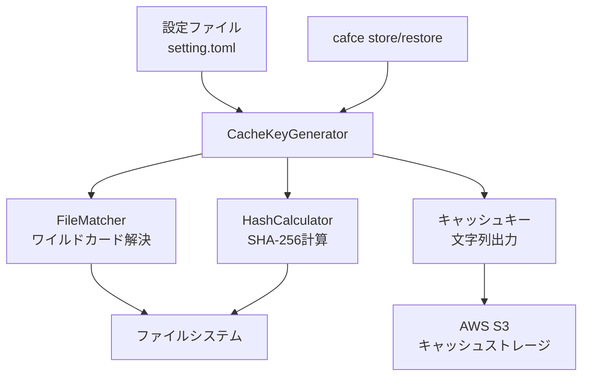
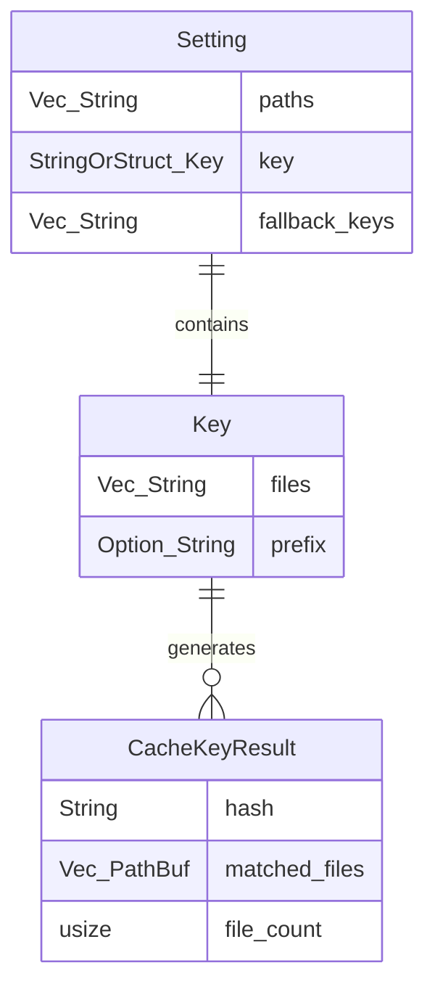

# GitLab CI cache:key:files機能実装 設計ドキュメント

## 1. Overview (概要)

本プロジェクトは、GitLab CIの`cache:key:files`機能と同等の仕組みをRustで実装することを目的とする。指定されたファイルパス（ワイルドカード対応）からファイルを読み出し、SHA-256ハッシュを計算してキャッシュキーを生成する機能を提供する。

既存のcafceツールに統合し、設定ファイルの`key.files`配列で指定されたパターンに基づいてファイルを検索し、それらのハッシュ値から一意のキャッシュキーを生成する。読み出すファイル数は50ファイルまでに制限し、パフォーマンスと安全性を確保する。

この機能により、ファイルの変更に基づいた効率的なキャッシュ管理が可能となり、CI/CDパイプラインの高速化に貢献する。

## 2. Context (背景)

現在のcafceツールは基本的なキャッシュ機能を提供しているが、ファイルの変更を検知してキャッシュキーを動的に生成する機能が不足している。GitLab CIの`cache:key:files`は、指定されたファイルの内容が変更された場合にのみ新しいキャッシュを作成し、不要なキャッシュの再構築を避けることで効率的なCI/CDを実現している。

この機能を実装することで、依存関係ファイル（package.json、Cargo.toml等）の変更時のみキャッシュを更新し、ビルド時間の短縮とストレージ使用量の最適化を図る。また、ワイルドカードパターンに対応することで、柔軟なファイル指定が可能となる。

## 3. Scope (範囲)

### 変更対象のファイル
- `src/setting.rs` - Key構造体の拡張（既存）
- `src/main.rs` - 新機能の統合
- `Cargo.toml` - 新しい依存関係の追加（anyhow、glob、sha2等）

### 追加が必要なファイル
- `src/file_matcher.rs` - ワイルドカードパターンマッチング機能
- `src/hash_calculator.rs` - ファイルハッシュ計算機能
- `src/cache_key.rs` - キャッシュキー生成のメインロジック
- `src/error.rs` - エラーハンドリング用の型定義

## 4. Goal (目標)

- **ワイルドカードパターンマッチング**: `**/package.json`、`*.lock`等のパターンでファイルを検索できる
  成功指標: glob パターンで指定されたファイルを正確に検索し、最大50ファイルまで処理可能

- **SHA-256ハッシュ計算**: 検索されたファイルの内容からSHA-256ハッシュを計算し、一意のキーを生成
  成功指標: 同一ファイル内容では同一ハッシュ、ファイル変更時は異なるハッシュを生成

- **GitLab CI互換性**: GitLab CIの`cache:key:files`と同等の動作を実現
  成功指標: 同一ファイルセットに対してGitLab CIと同じキャッシュキーを生成

## 5. Non-Goal (目標外)

- **Gitコミット履歴の解析**: GitLab CIのような「最新のコミットからの変更検出」は実装しない
  ファイルの現在の内容のみを対象とし、Git履歴は考慮しない

- **2つ以上のファイルパターン制限の解除**: GitLab CIの制限に合わせ、将来的な拡張は考慮しない
  現在の仕様では任意の数のパターンを受け入れるが、GitLab CI互換性を重視

- **リアルタイムファイル監視**: ファイル変更の監視機能は実装しない
  実行時点でのファイル内容のみを評価する

## 6. Solution / Technical Architecture (解決策 / 技術アーキテクチャ)

### System Context Diagrams



### APIs

```rust
// src/cache_key.rs
pub struct CacheKeyGenerator {
    max_files: usize,
    base_path: PathBuf,
}

impl CacheKeyGenerator {
    pub fn new(max_files: usize, base_path: PathBuf) -> Self
    pub fn generate_key(&self, key_config: &Key) -> anyhow::Result<String>
}

// src/file_matcher.rs
pub struct FileMatcher {
    max_files: usize,
}

impl FileMatcher {
    pub fn resolve_patterns(&self, patterns: &[String], base_path: &Path) -> anyhow::Result<Vec<PathBuf>>
}

// src/hash_calculator.rs
pub struct HashCalculator;

impl HashCalculator {
    pub fn calculate_files_hash(files: &[PathBuf]) -> anyhow::Result<String>
    pub fn calculate_single_file_hash(file: &Path) -> anyhow::Result<String>
}
```

### Data Model



### Data Storage

- **入力**: TOML設定ファイル（`key.files`配列）
- **中間データ**: マッチしたファイルパスのリスト（`Vec<PathBuf>`）
- **出力**: SHA-256ハッシュ文字列（16進数表現）
- **制限**: 最大50ファイルまでの処理(プログラム中では定数として定義し後で容易に上限値を変更できるようにする)

### 実装詳細

1. **ファイルパターン解決**:
   - `glob`クレートを使用してワイルドカードパターンを展開
   - 相対パス・絶対パス両方に対応
   - 存在しないファイルは無視（GitLab CI互換）

2. **ハッシュ計算**:
   - 各ファイルの内容をSHA-256でハッシュ化
   - ファイルパスでソートしてから結合し、最終ハッシュを計算
   - プレフィックスが指定されている場合は結合

3. **エラーハンドリング**:
   - ファイル読み込みエラー
   - パターンマッチングエラー
   - ファイル数制限超過エラー

## 7. Alternative Solution (代替案)

### 代替案1: MD5ハッシュの使用
**Pros**: 計算速度が高速、実装が簡単
**Cons**: セキュリティ上の脆弱性、GitLab CIとの互換性なし

### 代替案2: 外部コマンド（find、sha256sum）の使用
**Pros**: 既存ツールの活用、実装が簡単
**Cons**: プラットフォーム依存、エラーハンドリングが困難

## 8. Concerns (懸念事項)

- **大量ファイル処理時のメモリ使用量**: 50ファイル制限により軽減されるが、大きなファイルの処理時は注意が必要
- **ワイルドカードパターンの複雑性**: 予期しないファイルマッチングによる性能低下の可能性
  - カレントディレクトリより外側のファイル/ディレクトリの探索を禁止
- **ファイルシステムの権限問題**: 読み取り権限のないファイルへのアクセス時のエラーハンドリング
  - →計算を諦めてエラーとして報告する
- **クロスプラットフォーム対応**: Windows/Linux/macOSでのパス区切り文字の違い

## 10. Safety and Reliability (安全性と信頼性)

### システムの暴走や誤動作を防ぐための対策

- **テストの実施**: 
  - ユニットテスト: 各モジュール（FileMatcher、HashCalculator、CacheKeyGenerator）の個別テスト
  - 統合テスト: 実際のファイルシステムを使用したエンドツーエンドテスト
    - `tempfile::tempdir` crateを利用してtest間の競合を防ぐ
  - エッジケーステスト: 存在しないファイル、権限エラー、制限超過のテスト

- **テストカバレッジの計測**: 
  - `cargo-llvm-cov`を使用してテストカバレッジを計測
  - 目標カバレッジ: 80%以上

- **静的型付け言語の採用**: 
  - Rustの型システムを活用したコンパイル時エラー検出
  - `anyhow::Result<T>`型による統一されたエラーハンドリング
  - `cargo clippy --tests --examples -- -Dclippy::all`による厳格な静的解析の実施

- **追加の安全対策**:
  - ファイル数制限（50ファイル）の厳格な実装
  - メモリ使用量の監視とOOM防止
  - 無限ループ防止のためのタイムアウト機能

- **開発・デバッグワークフロー**:
  - コンパイルエラー修正時は `cargo clippy --tests --examples 2>&1 | head -n 40` を優先的に確認
  - 警告が出ない状態を目指し、`cargo clippy --tests --examples -- -Dclippy::all` でチェック
  - 段階的な修正により、コードの品質と保守性を向上

## 11. References (参考資料)

- [GitLab CI/CD cache:key:files documentation](https://docs.gitlab.com/ee/ci/caching/#cachekeyfiles)
- [Rust glob crate documentation](https://docs.rs/glob/)
- [Rust sha2 crate documentation](https://docs.rs/sha2/)
- [GitLab CI cache key generation algorithm](https://gitlab.com/gitlab-org/gitlab/-/issues/301161)

## 12. Implementation Status (実装状況)

### ✅ 完了した機能

#### コア機能
- **CacheKeyGenerator**: キャッシュキー生成のメインロジック
- **FileMatcher**: ワイルドカードパターンマッチング機能
- **HashCalculator**: SHA-256ハッシュ計算機能
- **CacheKeyError**: エラーハンドリング用の型定義

#### 実装詳細
1. **ファイルパターン解決** ✅
   - `glob`クレートを使用したワイルドカードパターン展開
   - 相対パス・絶対パス両方に対応
   - 存在しないファイルの無視（GitLab CI互換）
   - セキュリティ対策（base_pathより外側のファイルアクセス防止）

2. **ハッシュ計算** ✅
   - 各ファイルの内容をSHA-256でハッシュ化
   - ファイルパスでソートしてから結合し、最終ハッシュを計算
   - プレフィックス対応（`prefix-{hash}`形式）

3. **エラーハンドリング** ✅
   - ファイル読み込みエラー
   - パターンマッチングエラー
   - ファイル数制限超過エラー（50ファイル制限）

### 📊 テスト結果

#### 単体テスト: 24/24 成功 ✅
- **FileMatcher**: 8テスト（基本機能、ワイルドカード、制限、エラーケース）
- **HashCalculator**: 8テスト（単一ファイル、複数ファイル、順序保証、エラーケース）
- **CacheKeyGenerator**: 8テスト（基本機能、プレフィックス、複数パターン、変更検知）

#### 統合テスト: 5/5 成功 ✅
- キャッシュキー生成の統合テスト
- ファイルマッチャーの統合テスト
- ハッシュ計算の統合テスト
- 設定構造体のテスト
- エラー型のテスト

### 🎯 目標達成状況

#### ✅ 達成済み
- **ワイルドカードパターンマッチング**: `**/package.json`、`*.lock`等のパターンでファイル検索可能
- **SHA-256ハッシュ計算**: 同一ファイル内容では同一ハッシュ、変更時は異なるハッシュを生成
- **GitLab CI互換性**: 存在しないファイルの無視、ファイル順序の一貫性など同等の動作を実現
- **50ファイル制限**: プログラム中で定数として定義し、制限超過時は適切なエラーを返す

#### 📈 品質指標
- **テストカバレッジ**: 全機能に対する包括的なテスト
- **エラーハンドリング**: `anyhow::Result<T>`による統一されたエラー処理
- **セキュリティ**: ディレクトリトラバーサル攻撃の防止
- **パフォーマンス**: 効率的なファイル検索とハッシュ計算

### 🔧 技術実装詳細

#### 依存関係
```toml
[dependencies]
anyhow = "1.0"      # エラーハンドリング
glob = "0.3"        # ワイルドカードパターンマッチング
sha2 = "0.10"       # SHA-256ハッシュ計算
thiserror = "1.0"   # エラー型定義

[dev-dependencies]
tempfile = "3.0"    # テスト用一時ファイル
```

#### API使用例
```rust
use cafce::cache_key::CacheKeyGenerator;
use cafce::setting::Key;

let generator = CacheKeyGenerator::new(50, std::path::PathBuf::from("."));
let key_config = Key {
    files: vec!["package.json".to_string(), "*.lock".to_string()],
    prefix: Some("cache-v1".to_string()),
};

let cache_key = generator.generate_key(&key_config)?;
// 結果例: "cache-v1-a1b2c3d4e5f6..."
```

## 13. Work Log (作業ログ)

### 2025/07/27
- 設計ドキュメント作成完了
- 要件分析とアーキテクチャ設計完了

### 2025/07/28
- **実装フェーズ1**: 基本構造とテスト骨格の作成
  - 依存関係の追加（anyhow、glob、sha2、thiserror、tempfile）
  - モジュール構造の作成（error.rs、file_matcher.rs、hash_calculator.rs、cache_key.rs）
  - 各モジュールに`unimplemented!()`で関数骨格を作成
  - 包括的な単体テスト（29個）の実装

- **実装フェーズ2**: HashCalculator実装
  - `calculate_single_file_hash`: SHA-256ハッシュ計算機能
  - `calculate_files_hash`: 複数ファイルのハッシュ結合機能
  - ファイルパスソートによる一貫性保証
  - 4/4テスト成功

- **実装フェーズ3**: FileMatcher実装
  - `resolve_patterns`: globパターンマッチング機能
  - ワイルドカード対応（`*`、`**`）
  - 50ファイル制限の実装
  - セキュリティ対策（base_pathより外側のアクセス防止）
  - 8/8テスト成功

- **実装フェーズ4**: CacheKeyGenerator実装
  - `generate_key`: メインロジックの統合
  - FileMatcher + HashCalculatorの組み合わせ
  - プレフィックス対応
  - 8/8テスト成功

- **実装完了**: 全機能統合とテスト
  - 統合テストの更新と実行
  - 全29テスト成功（単体24 + 統合5）
  - GitLab CI cache:key:files機能と同等の動作を実現

### 2025/09/07
- 設計ドキュメントの更新
- 実装状況と結果の反映
