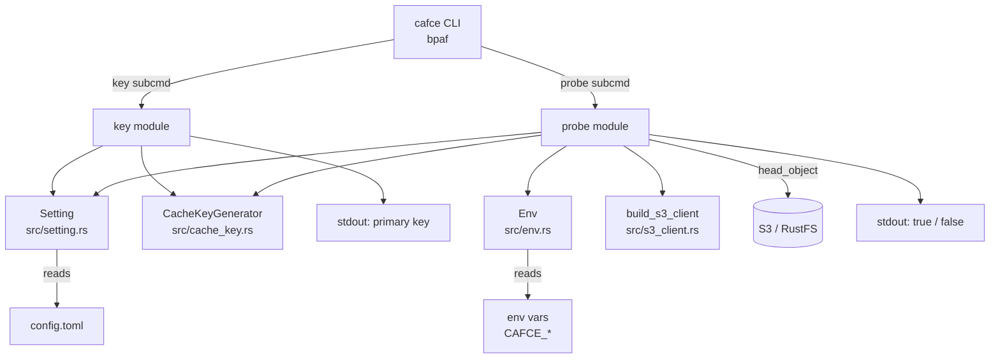

# probe/key サブコマンドと config file 拡張 設計ドキュメント

## 1. Overview (概要)

本ドキュメントは、issue #6「キャッシュキーを計算してS3 APIでファイルの照会をして、キャッシュがあるかどうか判定する機能を追加する」に対応するための設計をまとめたものである。既に #3 でキー計算ロジック（`CacheKeyGenerator`）、#2 で S3 クライアント構築（`build_s3_client`）が実装済みであることを前提に、これらを繋いで cafce の CLI として利用可能にする。

具体的には、TOML 形式の config file をキャッシュ設定の中心的な情報源として位置づけ、`key` サブコマンド（config を元にキャッシュキーを計算して出力）と `probe` サブコマンド（キャッシュキーに対応するオブジェクトが S3 上に存在するかを判定）を追加する。加えて、複数リポジトリで同一バケットを相乗り利用することを見据えた S3 オブジェクトキーのレイアウトを確定する。

本フェーズでは実際のキャッシュ本体の格納・取得は行わない（#7 の担当）。あくまで「キー計算」と「存在判定」という、副作用が read-only な機能に閉じることで、後続の #7 に安全な基盤を提供することを目的とする。

## 2. Context (背景)

現状の cafce は以下の状態にある：

- `src/cache_key.rs` にキー計算ロジックが揃っている（#3 マージ済み）
- `src/s3_client.rs` に S3 クライアント構築が揃っている（#2 マージ済み）
- `src/setting.rs` に config 構造体と TOML I/O の仮組みが存在するが、単体テストが無く、フィールドが private で外部から利用できない
- `src/main.rs` の `Store`/`Restore` は `println!` のみで実処理を持たない
- `key`/`probe` サブコマンド、および `-h`/`--help` の英語対応は未実装
- S3 上のオブジェクトキーのレイアウト（bucket をどこで持つか、prefix・project 名前空間をどう構成するか）は未決定
- `Env` / `s3_client` モジュールが `lib.rs` に公開されておらず、統合テスト（`tests/` 配下）から利用できない（#2 の申し送り）

一方で issue #6 の完了定義には、config file フォーマットの確定、`key`/`probe` の実装、`-h`/`--help` 対応、標準出力の日本語ドキュメント化、単体テスト・rustfs 宛統合テストの実装、が含まれている。これらを一括で満たすための設計判断をここでまとめる。

fallback キャッシュ（キー未ヒット時に代替キーを試す機構）については GitLab CI と GitHub Actions で意味論が大きく異なる。cafce としてはどちらに寄せるかを本ドキュメントで確定し、判定軸（primary → `fallback_keys` の順序試行、完全一致）を本フェーズで実装する。`probe` サブコマンドがこの判定軸を用いて存在確認を行う（primary miss 時に `fallback_keys` を順に試行、いずれか hit で `true`）。#7 の `restore` は同じ判定軸を再利用して実際のダウンロードを行うため、`probe` と `restore` の判定結果は乖離しない。

## 3. Scope (範囲)

### 変更対象ファイル

| ファイル | 役割 |
|---|---|
| `src/setting.rs` | `Setting` 構造体を確定させる（`project` フィールド追加、フィールド公開、`thiserror` 化、単体テスト追加） |
| `src/env.rs` | `CAFCE_AWS_BUCKET`（必須）、`CAFCE_S3_PREFIX`（任意）フィールドを追加 |
| `src/cache_key.rs` | `files` 全てが未マッチのときに `default` / `<prefix>-default` へフォールバックする挙動へ変更（詳細は 6.10 参照） |
| `src/error.rs` | `CacheKeyError::NoFilesMatched` バリアントを削除（cache_key.rs の挙動変更に伴い dead code 化するため） |
| `src/lib.rs` | `env` / `s3_client` を `pub mod` として公開（統合テストから利用可能にする） |
| `src/main.rs` | `key` / `probe` サブコマンドを追加。`#[tokio::main]` + `run() -> anyhow::Result<()>` の分離、`.unwrap()` 廃止、library crate (`cafce::*`) からの import へ移行。既存の `Store` / `Restore` は #6 スコープ外だが、`-h`/`--help` の英語文言と bpaf 定義の整理は行う。詳細は §6.11 |
| `Cargo.toml` | `tokio` を `[dev-dependencies]` から `[dependencies]` に移動（features は `rt-multi-thread`, `macros`）。他の依存追加は原則不要（変数展開は自前実装、S3 head_object は既存 `aws-sdk-s3` で対応）。詳細は §6.11 |
| `README.md` | 新規 env 変数と TOML フォーマット、`key`/`probe` の使い方を追記 |

### 新規追加ファイル

| ファイル | 役割 |
|---|---|
| `src/probe.rs` | `probe` サブコマンドのロジック（primary → `fallback_keys` の順序試行、S3 head_object による存在判定、first hit で short-circuit） |
| `src/subcommand/` 相当 or `main.rs` 内関数 | `key` サブコマンドのロジック配置場所は実装時に決める |
| `doc/feature/display_logs.md` | cafce の各サブコマンドが標準出力・標準エラー出力に出すメッセージの日本語仕様書 |
| `tests/probe_integration.rs`（仮称） | rustfs 宛の `probe` 統合テスト（`docker-compose up -d` された前提で動作） |

### 変更対象外

| ファイル | 理由 |
|---|---|
| `src/file_matcher.rs` / `src/hash_calculator.rs` | #3 で確定済み。挙動を維持する |
| `src/s3_client.rs` | #2 で確定済み。`build_s3_client` の API を変更しない |

## 4. Goal (目標)

- **config file フォーマットの確定**: TOML 形式で `project` を必須、`key`（literal String または `{files, prefix}`）を必須、`fallback_keys` は #6 の `probe` から使用、`paths` は #7 のために予約フィールドとして受け入れる
  成功指標: `Setting::new_from_file` が typed error でパースエラーを返し、単体テストで round-trip・パース失敗ケースをカバーできること

- **`key` サブコマンドの実装**: config file を読み、CWD を base_path として `CacheKeyGenerator::generate_key` を呼び、結果を stdout に 1 行で出力する
  成功指標: 同一の config・同一のファイル内容に対して同じキー文字列が出力されること（#3 の regression テストと整合）

- **`probe` サブコマンドの実装**: `key` と同じ経路で primary key を計算し、`{prefix?}/{project}/<key>` のオブジェクトキーに対して primary → `Setting.fallback_keys` の各要素の順に `head_object` を発行、いずれか存在すれば `true`、全 miss なら `false` を stdout に出力する
  成功指標: rustfs 統合テストで、(a) primary key を事前に `put_object` した場合／(b) primary は無いが fallback_keys のいずれかを `put_object` した場合／いずれも `true` を返し、(c) 何も `put_object` していない場合に `false` を返すこと

- **CLI 全体の `-h`/`--help` 英語対応**: bpaf の doc comment / `help` 属性でトップレベルおよび各サブコマンド（既存の `Store`/`Restore`/`Init` を含む）の説明を英語で提供する
  成功指標: `cafce --help` および各 `cafce <subcmd> --help` が英語のヘルプを出力すること

- **標準出力の日本語ドキュメント化**: `doc/feature/display_logs.md` に、各サブコマンドが正常系・異常系で何を stdout / stderr に出すかを日本語で列挙する
  成功指標: `key` / `probe` について、正常出力・想定エラー出力の全パターンが列挙されていること

- **単体テストと rustfs 統合テスト**: `setting.rs` の TOML パース、`env.rs` の bucket/prefix 読み取り、`probe.rs` のオブジェクトキー組み立てを単体テストで、rustfs に対する hit/miss ケースを統合テストでカバーする
  成功指標: `cargo test` で全テストが通り、`docker compose up -d` 済み環境で統合テストが hit/miss 両方通ること

## 5. Non-Goal (目標外)

- **キャッシュ本体の格納・取得**: `store` / `restore` の実装は #7 で扱う。cafce 本体には payload を S3 に置く/取ってくる機能はまだ入らない

- **`restore` サブコマンドでの fallback 適用**: `restore` 自体を #7 で実装するため、fallback キーからのダウンロードロジックは #7 の担当。ただし `Setting.fallback_keys` の判定軸（順序試行、完全一致）は本フェーズで確定・実装し、`probe` から先行して使用する。#7 は `restore` を組むだけでこの判定軸を再利用できる

- **圧縮形式・オブジェクトの metadata 仕様**: 本体格納が #7 スコープなので、metadata の設計もそちらに委ねる

- **認証機構の変更**: `build_s3_client` の API はそのまま使う。#9（`aws login` / `aws sso login`）は別枠

- **CI predefined env 変数からの `project` 自動導出**: local 実行時の挙動が複雑化し、GitHub Actions の PR-from-fork では自動分離も完全ではないため、config 必須で確定する

## 6. Solution / Technical Architecture (解決策 / 技術アーキテクチャ)

### 6.1 全体像



### 6.2 config file フォーマット（TOML）

TOML の table 見出し (`[key]`) 以降のトップレベル key/value は全てそのテーブルの子になるため、**トップレベルのスカラー・配列は `[key]` テーブルより前に書く**必要がある。以下はいずれも有効：

**形式 1: literal String 形態**

```toml
# 必須: プロジェクト名前空間。S3 オブジェクトキーの一部になる
project = "my-app"

# 必須: 単一の literal 文字列 or { files, prefix } の 2 形態を受け付ける
key = "cache-${CI_COMMIT_REF_SLUG}"

# #6 で probe が使用（primary miss 時に順序試行）。#7 で restore からも同じ判定軸を再利用
fallback_keys = ["cache-${CI_DEFAULT_BRANCH}", "cache-default"]

# #6 では受け付けるが未使用（#7 で store/restore の圧縮対象として使う）
paths = []
```

**形式 2: files-based（テーブル）形態**

```toml
project = "my-app"
# トップレベル値は必ず [key] より前に書く（TOML 仕様上、[key] 以降は key テーブルの子になる）
fallback_keys = []
paths = []

[key]
files = ["Cargo.lock", "package.json"]
prefix = "deps-v1"  # 任意
```

**形式 3: files-based（inline table）形態**

```toml
project = "my-app"
key = { files = ["Cargo.lock"], prefix = "deps-v1" }
fallback_keys = []
paths = []
```

- `project` は必須。未指定または空文字は `Setting::new_from_*` 内でバリデーションし、typed error で拒否
- `key` は `StringOrStruct<Key>` 型で literal / files-based の両形態を許容（既存構造を踏襲）
- `fallback_keys` は #6 の `probe` から使用される（`${VAR}` 展開、完全一致順序試行）。空配列がデフォルト
- `paths` は #6 では未使用（#7 で store/restore の圧縮対象として使う）。パースは通すが読み捨てる。空配列がデフォルト
- 未知のキーは **`#[serde(deny_unknown_fields)]` を有効化して拒否**する。cafce v0.1 段階では前方互換性を保つ user がおらず、user の typo を silent に無視することの実害の方が大きいため。将来 cafce v1.0 前後で semver 運用を明文化するタイミングで再考する

### 6.3 環境変数

| 変数 | 必須 | 用途 |
|---|---|---|
| `CAFCE_AWS_BUCKET` | ✅ | キャッシュを置く S3 バケット名 |
| `CAFCE_S3_PREFIX` | — | S3 オブジェクトキーの先頭に付ける任意の prefix（末尾スラッシュは正規化） |
| `CAFCE_AWS_*` (既存) | 状況により | エンドポイント・リージョン・認証情報等（#2 で定義済み） |

### 6.4 S3 オブジェクトキーのレイアウト

```
{bucket}/{prefix?}/{project}/{cache_key}
```

- `{bucket}`: `CAFCE_AWS_BUCKET`
- `{prefix?}`: `CAFCE_S3_PREFIX` が指定されていれば挿入、なければ省略
- `{project}`: `Setting.project`
- `{cache_key}`: `CacheKeyGenerator::generate_key` の戻り値

**設計意図**:
- bucket はインフラ（AWS アカウント）依存なので env
- prefix は運用ポリシー依存なので env
- project は repo 依存なので config
- cache_key は入力ファイル依存なので計算値

複数リポジトリで同一バケットを相乗り利用しても、`{project}` セグメントで名前空間が分離される。

**注意: `project` は運用上の名前空間分離であってセキュリティ境界ではない**。バケットへの書き込み権限を持つ user は任意の `{project}` 配下に書き込めるため、真のマルチテナント分離が必要な場合は以下のいずれかを併用する:

- バケット単位でテナントを分ける
- IAM ポリシーで `arn:aws:s3:::bucket/prefix/project/*` の形で prefix 制限を掛ける

cafce 側は運用規約としての名前空間しか提供しない。

### 6.5 サブコマンド仕様

#### primary key の共通解決経路

`Setting.key` は `StringOrStruct<Key>` 型で literal String / files-based の 2 形態を許容するため、両者を吸収する共通の解決経路を用意し、`key` と `probe` の双方が使う。

- 共通関数（実装者判断で `impl Setting` のメソッド or module-level 関数）:
  - `Setting.key` が `StringOrStruct::String(s)` の場合: `${VAR}` 展開済みの literal 文字列 `s` をそのまま返す（`CacheKeyGenerator` は呼ばない）
  - `Setting.key` が `StringOrStruct::Struct(k)` の場合: `CacheKeyGenerator::generate_key(&k)` に委譲。CWD を `base_path` として使用
- §6.10 の files 0 件フォールバック（`default` / `<prefix>-default`）は **Struct 形態にのみ適用**される（literal String 形態には該当する概念がない — 文字列そのものがキー）
- `AbsolutePathNotAllowed` エラーも Struct 形態でのみ発生し得る（literal String に glob 概念がない）

#### `cafce key <config>`
- config file を読む
- 上記の共通解決経路で primary key を得る
- 成功時: 戻り値を stdout に 1 行で出力（改行含む）、exit code 0
- 失敗時（`AbsolutePathNotAllowed` / config パース失敗 / env 未設定等）: stderr にエラー、exit code 非 0
- **`NoFilesMatched` は失敗条件から除外**（§6.10 のフォールバックが働くため、0 件マッチはエラーにならず `default` / `<prefix>-default` が返る）

#### `cafce probe <config>`
- config file を読む
- 上記の共通解決経路で primary key を計算（`key` と同じ経路）
- `Setting.fallback_keys` の各要素は `${VAR}` 展開済みの literal 文字列として利用可能（config パース時に一括展開されている）
- `Env::new()` で bucket / prefix を読む
- `build_s3_client` で S3 クライアントを構築
- primary → `fallback_keys` の各要素の順に、`{prefix?}/{project}/<key>` のオブジェクトキーに対して `head_object` を発行:
  - いずれか 200 → stdout `true`、exit code 0（**先頭でヒットした時点で以降の head_object は打たない**、short-circuit）
  - 全て NotFound (404) → stdout `false`、exit code 0
  - **途中で NotFound 以外のエラー**（403 / リージョン不一致 (301/400) / 認証失敗 / ネットワークエラー等） → stderr にエラー内容、exit code 非 0（後続の fallback は試さない。エラー→ヒットで結果的に成功に見えてしまうのを避ける）
- `fallback_keys` が空リストなら primary のみを対象
- `key` サブコマンドと異なり、fallback_keys の値は `probe` の内部で消費されるだけで stdout には出力されない

**403 (AccessDenied) の扱い**:

AWS S3 では `s3:ListBucket` 権限が無い場合、**存在しないキーへの `HeadObject` が 404 ではなく 403 で返る**。cafce ではこれを:

- **miss として扱わない**（silent auth failure による永続的な cache miss を防ぐため。silent miss は CI では毎回フルビルドを引き起こしつつ user が原因に気付けない致命的パターン）
- **error として stderr に伝播、exit 非 0 で終了**する
- エラーメッセージには「`s3:ListBucket` 権限を確認してください」等の IAM ヒントを含める
- したがって cafce が要求する IAM 権限は `s3:GetObject` **と** `s3:ListBucket` の両方。README には必須権限として明記する（実装フェーズで対応）

RustFS は正しく 404 を返すため、この 403 経路は **RustFS 統合テストでは検出できない**。実 AWS 環境で fail-fast する挙動として仕様化し、疎通テストの延長として user 側で検証可能にする。

#### 未対応サブコマンド
- bpaf の標準動作（unknown command → usage 表示 + 非 0 終了）でエラーになれば要件を満たす

#### `-h`/`--help`
- トップレベルと各サブコマンドに英語の doc comment / `help` 属性を付与
- bpaf の `#[bpaf(options)]` / `#[bpaf(command)]` に対する `/// ...` doc コメントで実装できる

### 6.6 変数展開

**採用構文**: `${VAR}` のみ

- `$VAR`（波括弧なし）はサポートしない（ambiguity 回避）
- `\${VAR}` によるエスケープは #6 では**未対応**（需要が具体化したら非破壊的に後付け可能）
- 展開対象は全 env 変数（cafce が特定の変数名だけ拾うのではなく、`std::env::var` で解決）
- **未定義変数**への参照はエラー（silent に空文字にはしない）
- **定義済みだが値が空文字**の変数（`std::env::var` が `Ok("")` を返す場合）は展開処理としては**通す**（結果が空文字になるだけ）
- **再帰展開はしない**（1 パス限り。展開結果に `${...}` が含まれても literal として扱う）

**適用範囲の設計原則**:

「String 値が cache key の一部を構成するなら展開、ファイルシステムパスなら展開しない」というシンプルルールに則る。

| フィールド | 展開 | 理由 |
|---|---|---|
| `Setting.project` | ✅ | namespace 部分。user が opt-in で env 由来の分離（例: `project = "${CI_PROJECT_ID}"`）を書きたいケースをサポート。auto-derivation の却下（6.2 参照）とは独立で、user 手書きの opt-in は許容する |
| `Setting.key`（literal String 形態） | ✅ | cache key そのもの。GitLab 相当のブランチ別キー（例: `key = "cache-${CI_COMMIT_REF_SLUG}"`）が書ける |
| `Setting.key.prefix` | ✅ | cache key の名前空間切り分け（例: `prefix = "deps-${CI_COMMIT_REF_SLUG}"`） |
| `Setting.fallback_keys` の各要素 | ✅ | 完全一致列挙のため、ブランチ別 fallback を書くのに必須 |
| `Setting.key.files` | ❌ | glob パターン。展開せず literal として `glob::glob` に渡す（`${` は glob のメタ文字ではないので、`${VAR}` を含むファイル名にも一応対応できる） |
| `Setting.paths`（#7 で使用） | ❌ | ファイルパス。files と同じ扱い |

**展開のタイミング**:

`Setting::new_from_file`（or 相当）内で、TOML パース直後にfield-specific validation（`project = ""` 拒否等）と組み合わせて **一括展開**する（fail-fast）。

- 展開自体のエラー（未定義変数参照）: `SettingError::UndefinedVariable { name }` のような typed error として区別可能に
- 展開後の field validation エラー（例: 展開結果が `project = ""` になる）: field validation のエラーとして区別可能に

**#6 での実装範囲**:

- `project` / `key`(literal) / `Key.prefix` は #6 の `key` / `probe` サブコマンドで実際に使うため、**展開ロジックは #6 で実装する**
- `fallback_keys` の各要素の展開もパース時に行う。値は `probe`（#6）と `restore`（#7）の両方で消費される

### 6.7 GitLab / GitHub Actions からの参照点

fallback キャッシュの意味論は GitLab CI に寄せる：

| 項目 | 選択 | 根拠 |
|---|---|---|
| マッチ方式 | 完全一致列挙（GitLab 流） | `probe`（および #7 の `restore`）で `head_object` のみで済み、`list_objects_v2` を要さない |
| 変数展開 | 全 env 変数、`${VAR}` 構文 | 完全一致だとブランチ別 fallback を書くのに変数展開が必須。GitLab は変数展開をサポートしている |
| 選択順序 | 順序指定通りに順次試行（GitLab 流） | GitHub Actions の「LastModified 最新」は S3 側で list_objects_v2 + sort が必要でコストが高い |

### 6.8 `lib.rs` の公開範囲拡張

現状 `env` / `s3_client` は `main.rs` からのみ `mod` されている。#6 の統合テスト（`tests/` 配下）で `probe` のロジックを再利用するため、`lib.rs` に以下を追加する：

```rust
pub mod env;
pub mod s3_client;
// 既存
pub mod error;
pub mod file_matcher;
pub mod hash_calculator;
pub mod cache_key;
pub mod setting;
// 新規
pub mod probe;
```

### 6.9 `doc/feature/display_logs.md` の構成方針

- 見出しは `## key サブコマンド` / `## probe サブコマンド` のようにサブコマンドごとに切る
- 各サブコマンドで「正常系の stdout」「正常系の stderr（未使用の場合は明記）」「異常系の stderr メッセージ一覧」を列挙
- 日本語で記述（issue #6 完了定義に従う）
- 将来 `store`/`restore` が加わったら本ドキュメントに節を追加していく

### 6.10 files 0 件時のフォールバック挙動

`Setting.key` が `Key { files, prefix }` 形態で、`files` パターンにマッチするファイルが 1 つも存在しない場合の挙動を GitLab CI (`cache:key:files`) に寄せる。

**GitLab の documented 挙動**:
- 一部のファイルだけ存在するときは、存在するファイルだけをハッシュ計算に使う（missing は silently skip）
- どのファイルも存在しないときは literal `default` にフォールバック
- prefix が指定されていれば `<prefix>-default`（GitLab 公式例: prefix が `rspec` なら `rspec-default`）

**cafce での対応**:
- 一部のみ存在するケースは既に #3 で GitLab 互換（`FileMatcher::resolve_patterns` が missing を silently skip、テストコメントに「GitLab CI互換」と明記あり）
- どのファイルも存在しないケースは、#3 では `CacheKeyError::NoFilesMatched` エラーで中断していたが、本フェーズで**GitLab 準拠のフォールバックに変更**する:
  - prefix なし → `default`
  - prefix あり → `<prefix>-default`
- フォールバック発生時に stderr/stdout への warning や info ログは**出さない**（silent）。ログを出さない代わりに、`key` / `probe` サブコマンドの通常出力（生成されたキー文字列そのもの、および probe 時の S3 パス）で状況が可視化されるため、debug 可能性は保たれる
- `default` は literal 固定（config で override 可能にする機構は入れない）

**戻り値型・エラー型の変更**:
- `CacheKeyGenerator::generate_key` の戻り値型 `anyhow::Result<String>` はそのまま維持（`AbsolutePathNotAllowed` は依然エラーとして残るため）
- `CacheKeyError::NoFilesMatched` バリアントは dead code となるため `src/error.rs` から削除する
- `src/cache_key.rs` の `test_generate_key_no_matching_files` テストは、`assert!(result.is_err())` から `assert_eq!(result.unwrap(), "default")`（および prefix ありケースの `<prefix>-default`）へ更新する

**GitLab との細部の相違点（記録目的）**:
- GitLab は git 履歴（最新コミットの SHA）を使うため fallback 発動条件が "no file is changed in any commits" だが、cafce はファイル内容の SHA-256 を使うため fallback 発動条件は "no file exists" になる。fallback 後のキー文字列は同じ規則で組み立てる

**`probe` との相互作用**:
- `files` 0 件フォールバックで primary が `<prefix>-default` に落ちる場合でも、`Setting.fallback_keys` は独立して順序試行される（primary が default に落ちたことと fallback_keys 適用は互いに影響しない）
- 初回実行時は primary が `<prefix>-default` で存在せず、user が書いた fallback_keys もまだ存在しないことが多いため、`probe` は `false` を返すのが自然。CI 側の `store` フェーズ（#7）で primary key として `<prefix>-default` に置くことで整合する

### 6.11 async runtime・エラー伝播・モジュール境界

`probe` は `build_s3_client`（async）→ `head_object`（async）を呼ぶため、実行バイナリ側で async runtime を組み立てる必要がある。現状の `main.rs` は同期 + `.unwrap()` の書き捨てになっているため、以下を確定させる。

**tokio の位置づけ**:
- 現状 `Cargo.toml` の `[dev-dependencies]` にのみ `tokio` があり、bin ビルドでは使えない。**`[dependencies]` に移動**する
- 機能は `features = ["rt-multi-thread", "macros"]`。`rt` + `macros` だけでも `probe` は動くが、awssdk 側との互換性・将来 `store`/`restore` (#7) が並列処理を入れる可能性を考えると `rt-multi-thread` を選ぶのが無難
- 既存の `[dev-dependencies]` の tokio 定義は削除して `[dependencies]` に一本化

**main のエントリポイント**:
- `main.rs` は `#[tokio::main] async fn main() -> ExitCode` を採用（`std::process::ExitCode` を返すことでプロセス終了コードを Rust らしく扱う）
- 実際の処理は `run(opts: Opts) -> anyhow::Result<()>` のような別関数に切り出し、`main` は `run` の戻り値でエラー印字 + exit code 決定を行う:
  - `Ok(())` → `ExitCode::SUCCESS`
  - `Err(e)` → `eprintln!("{e:#}")` （`{:#}` で anyhow の chain 表示）→ `ExitCode::FAILURE`
- これにより既存の `.unwrap()` を廃し、issue #6 完了定義の「stderr にエラー・非 0 終了」「表示仕様に沿った出力」を満たす

**モジュール境界（bin と lib の関係）**:
- §6.8 で `lib.rs` に `env` / `s3_client` / `probe` を `pub mod` として公開する方針を決めた
- したがって `main.rs` 側の `mod env;` `mod s3_client;` `mod cache_key;` などの重複 `mod` 宣言は**廃止**する
- `main.rs` は `use cafce::{env, s3_client, probe, ...};` の形で library crate から import する
- `Cargo.toml` は `[lib]` と `[[bin]] name = "cafce"` を両立させる（デフォルトの `src/lib.rs` + `src/main.rs` 構成に従えば追加設定不要）
- テスト方針への含意（§10 でも触れる）: `run()` を lib 側に置くことで `tests/` から `cafce::run(...)` を呼べる pure integration test が可能になる

## 7. Alternative Solution (代替案)

### 代替案1: bucket 名を config file 側に置く

**Pros**:
- TOML 一本で完結し、env 変数を減らせる

**Cons**:
- bucket は AWS アカウント／実行環境依存であり、repo に依存しない
- CI 環境ごとに bucket を切り替えたいケースで env の方が自然
- 同一 repo を異なる bucket に対して動かすユースケース（本番/検証環境）で config を書き換える必要が生じる

**判断**: 却下。**env 側に置く**。

### 代替案2: `project` 名を CI predefined env 変数から自動導出する

**Pros**:
- fork や rename に自動追従できる（数値 ID を採用すれば rename にも耐性）
- config に書かなくて済む

**Cons**:
- GitLab CI では fork の PR パイプラインが fork 側で走るため自動分離が働くが、**GitHub Actions では PR-from-fork のワークフローが親側で走るため `GITHUB_REPOSITORY_ID` は親の ID になり、自動分離は完全ではない**
- local 実行時に env 変数が存在しないため、いずれにせよ config or CLI flag の fallback が必要になる
- 実装量が増える（GitLab / GitHub の変数名対応、fork 検出、fallback 経路）
- env は容易に上書き可能なので "セキュリティ" の観点でのメリットは無い

**判断**: 却下。**config 必須にする**。実装が単純で挙動が予測しやすく、必要になれば後から env fallback を非破壊的に追加できる。

### 代替案3: `probe` を primary key のみの判定にする

（注: 本代替案は当初 "primary + fallback の OR 判定" を代替案として却下していたが、後述の理由で判断を反転し、"primary のみ" 側を代替案として却下する形に書き直した。詳細は §12 Work Log 2026-07-22 を参照）

**Pros**:
- `probe` の意味論が「1 つのキーに対する存在確認」となり、実装がシンプル（head_object 1 発）
- fallback 判定を `restore`（#7）だけの責務に閉じ、責務分離が綺麗に見える

**Cons**:
- `restore` は fallback を順に試す設計（#7）。`probe` が primary のみだと、**`probe = false` でも `restore` を呼ぶと fallback がヒットする false-negative** が発生し、`probe` を信頼した user が判断ミスを起こす
- `restore` を「常に呼べば良しなに」の設計にする以上、`probe` は「`restore` の結果を予測する predicate」として使われる想定。同じ判定軸を共有する必要がある
- `probe` と `restore` の判定軸が乖離すると、user に「なぜ違う？」を都度説明する運用コストが恒常的に発生する

**判断**: 却下。`probe` は **primary + `fallback_keys` の OR 判定**を採用する（順序試行、first hit で `true`）。`restore`（#7）との判定軸の整合性を優先する。

### 代替案4: fallback_keys を GitHub Actions 流の prefix + LastModified にする

**Pros**:
- 列挙が不要で、`fallback_keys = ["cache-npm-"]` の 1 行で「直近の cache-npm-* を取得」が書ける
- ユーザー体験は良い

**Cons**:
- 実装に `list_objects_v2` と LastModified sort が必要でコスト高
- 権限も `s3:GetObject` に加えて `s3:ListBucket` が必要になる
- #6 の `probe` は primary の存在確認だけなので、この機構の恩恵は #7 の `restore` まで得られない
- GitLab に寄せる決定と統一性が取れない

**判断**: 却下。GitLab 流の完全一致に統一。

### 代替案5: 変数展開の構文で `$VAR` も受け付ける

**Pros**:
- envsubst / shell 準拠で慣れがある
- GitLab も `$VAR` / `${VAR}` を両方受け付けている

**Cons**:
- `$` を literal で含めたいケースが曖昧になる
- 単語区切りの解釈（`$VAR_x` は `${VAR}_x` か `${VAR_x}` か）で混乱を招く

**判断**: 却下。**`${VAR}` のみ**でスタート。必要になったら後から `$VAR` を非破壊的に追加できる（逆は破壊的変更）。

### 代替案6: `Setting.fallback_keys` フィールドを #6 では削除する（YAGNI）

（注: 本代替案は当初 "使わないフィールド" 前提で検討したが、代替案3 の反転により `fallback_keys` は #6 の `probe` で使用されるため、"使わない" 前提自体が失効している）

**Pros**:
- config file が現時点で使う値だけを持つ、という綺麗さがある（当初検討時の判断）

**Cons**:
- 既存の `Setting` からフィールドを削除し、#7 で追加し直すのは無駄な破壊的変更
- 既に `test/sample/setting.toml` に `fallback_keys` があるユーザー（現時点では自分だけだが）に対して壊れる
- **代替案3 の反転により `fallback_keys` は #6 の `probe` から使用されるようになった**ため、"未使用フィールド" の前提自体が失効している

**判断**: 却下。**フィールドは残す**。#6 の `probe` と #7 の `restore` の両方で消費される。

### 代替案7: `NoFilesMatched` をエラー中断のまま維持する

**Pros**:
- 設定ミス（typo で存在しないパスを指定）を即座に検知できる（#3 の元の判断根拠）
- silent フォールバックによる cache 名前空間の意図せぬ相乗りを防げる
- 「マッチが0件なら固定ハッシュ」的な silent 挙動が debug を難しくする、という #3 のコメント（`cache_key.rs:20-22`）に忠実

**Cons**:
- GitLab CI の documented 挙動（`<prefix>-default` へのフォールバック）と乖離する
- 本フェーズで fallback_keys 全体を GitLab 流に寄せる決定と一貫性が取れない
- 初回 CI 実行時など、正当な「まだファイルがない」ケースでも失敗する（`Cargo.lock` を commit する前のブートストラップが困難）
- `**/*.lock` のような glob で「ある branch にはあるが別 branch には無い」ケースが branch 依存でエラー化する

**判断**: 却下。GitLab 準拠のフォールバックに寄せる。silent fallback による typo 伝播リスクは、`key` / `probe` の通常出力で生成キー文字列が可視化されるため、CI ログを見れば debug 可能。

### 代替案8: フォールバック発生時に warning ログを stderr に出す

**Pros**:
- GitLab 準拠のフォールバックを行いつつ、user が typo に気付ける可能性が上がる
- silent と error の中間解

**Cons**:
- `key` サブコマンドは `KEY=$(cafce key config.toml)` の形で shell 経由で利用される想定であり、stdout は clean（キー文字列のみ）に保つ設計。stderr への警告は debug 目的なら残っても実害は少ないが、CI ログを騒がしくする副作用がある
- そもそも `key` / `probe` の通常出力でキー文字列が可視化されるので、warning がなくても debug は可能

**判断**: 却下。**完全 silent** で運用する。将来 `--verbose` や `--strict` フラグの需要が具体化したら非破壊的に追加できる。

### 代替案9: `#[serde(deny_unknown_fields)]` を有効化せず前方互換性を保つ

**Pros**:
- 将来 cafce に新しい field を追加した場合、その field を含む config を古い cafce が読んでも silent に無視されて動作する
- user が「新しい config 形式を先に書いておく」運用ができる

**Cons**:
- user の typo（例: `fallbackkeys = [...]` と書く）が silent に無視され、意図と違う設定で動く
- 今日 fallback_keys の挙動を GitLab に寄せた際、silent フォールバックによる cache 名前空間の意図せぬ相乗りを許容する判断をしたが、それは "GitLab 準拠" のための例外的な silent 許容であって、typo の silent 許容までを認めたわけではない
- cafce v0.1 段階では前方互換性の恩恵を受ける user がいない
- strict → loose への変更は非破壊、loose → strict への変更は破壊的。cheap な今のうちに strict にしておく方が後々の選択肢を広げる

**判断**: 却下。**`deny_unknown_fields` を有効化**する。cafce v1.0 前後で semver 運用を明文化するタイミングで再考する。

## 8. Concerns (懸念事項)

- **`CAFCE_AWS_BUCKET` 未設定時のエラーメッセージ**
  - `Env` パースが `envy::Error` を返すが、bucket は特に必須なので専用のエラーメッセージを付ける方が親切
  - 実装時に thiserror バリアントを追加する

- **`probe` の 404 / 403 判定**
  - `aws-sdk-s3` の `head_object` は 404 を `SdkError<HeadObjectError>` の中の `NotFound` バリアントで返す
  - リージョン不一致で 301/400 相当のレスポンスが返ることもあるため、`NotFound` 以外は false にせずエラーとして扱う
  - **AWS S3 では `s3:ListBucket` 権限が無いと存在しないキーへの HeadObject が 403 で返る**。cafce はこれを miss ではなく error として扱う（詳細は §6.5 の「403 の扱い」）
  - `HeadObjectError` の網羅的パターンマッチを実装時に確認。エラー分岐は `NotFound` のみ miss、それ以外は error として stderr へ

- **統合テスト実行の前提条件**
  - `docker compose up -d` で rustfs が起動していること
  - `CAFCE_AWS_SERVER_ADDRESS=localhost:9000` 他が事前に設定されていること
  - CI では #8（GitHub Actions 構築）で回すことになる。#6 では local 実行が通れば十分

## 10. Safety and Reliability (安全性と信頼性)

### テストの実施

**基本方針**: 単体テストで「入力→出力」のロジックを網羅的に pin し、統合テストは「コマンドが呼べて期待どおりの経路で動く」ことに閉じる（stdout の中身検査は単体テスト側で行う）。特に stdout / stderr へ出す文字列を組み立てる処理は**pure function として `key` / `probe` モジュール内に切り出し**、その関数を単体テストで検証する。この分離により、bpaf の subcommand 配線とは独立に出力形式の regression を防げる。

- **単体テスト**:
  - `src/setting.rs`:
    - `Setting::new_from_file` を TOML ファイル入力で駆動する。struct → TOML → struct の round-trip だけでなく、**user が手で書く想定の TOML 文字列**を入力にしたテストケースを積む
    - 既存の `test/sample/setting.toml` を regression テストとして読み込み、期待の struct になることを assert（config フォーマットが暗黙に壊れることを検知）
    - 有効ケース: literal String 形態 (`key = "static-key"`) / files-based 形態 (`[key] files = [...]`) / prefix 有無 / `paths` 空・非空 / `fallback_keys` 空・非空 / 全フィールド埋めた combined config
    - パースエラー系: 不正 TOML 構文、`project` 欠落、`project = ""`、`key` 欠落、型不一致（`project = 123` 等）、未知フィールドを含む TOML（`#[serde(deny_unknown_fields)]` により拒否されること）、`Key.files` に絶対パス（`AbsolutePathNotAllowed`）
    - **注意**: `Key.files` の glob パターンにマッチするファイルが 0 件のケースは、§6.10 の設計により**エラーではなくフォールバック**として `default` / `<prefix>-default` が返る。したがってパースエラー系ではなく、`cache_key.rs` の解決時の挙動としてテストする
    - 実装者判断で `new_from_str(&str)` に相当する内部関数を切り出すか、tempfile ベースで直接 `new_from_file` を叩くかを選ぶ。どちらでも上記ケースは表現可能
  - `src/env.rs`: `CAFCE_AWS_BUCKET` の必須チェック、`CAFCE_S3_PREFIX` の任意性、末尾スラッシュの正規化
  - `src/cache_key.rs`: 既存の `test_generate_key_no_matching_files` を挙動変更に合わせて更新（`assert_eq!(result.unwrap(), "default")`、および prefix ありケース `"my-prefix-default"` の追加）
  - `src/probe.rs`:
    - オブジェクトキーの組み立てロジック（`prefix?/project/<key>`）を pure function として切り出して単体でカバー
    - primary → `fallback_keys` の順序試行ロジックを、head_object を注入可能な形（例: trait 抽象や callback）で単体でカバー。ケース: (a) primary hit で fallback を試さない、(b) primary miss + 最初の fallback で hit、(c) primary miss + N 番目の fallback で hit、(d) 全 miss で `false`、(e) `fallback_keys` が空リスト（primary のみ試行）、(f) 途中で 404 以外のエラーが返ったら後続を試さずエラー伝播
    - head_object の実呼び出しは rustfs 統合テストで代替
  - **出力形成関数の単体テスト**: `key` / `probe` サブコマンドが stdout / stderr に出す文字列を組み立てる pure function を切り出し、以下を単体テストで pin:
    - `probe` の bool → `"true"` / `"false"` 文字列変換（`Debug` フォーマット依存にしない）
    - `key` のキー文字列出力（改行の有無を含めて）
    - エラー時 stderr メッセージが `display_logs.md` の記載と一致する

- **統合テスト**:
  - `tests/probe_integration.rs`（仮称）: rustfs に対して以下のケースを検証。**コマンドが例外なく実行完了できる**ことの確認までを主目的にし、stdout 文字列の詳細は単体テスト側で pin されているため深追いしない:
    - primary key のみ `put_object` → hit
    - primary は無いが `fallback_keys` の 1 つを `put_object` → hit（fallback 経由）
    - 何も `put_object` しない → miss
  - #2 の `s3_client.rs` 内テストにならい、テストごとにユニークな bucket / project 名を使って衝突を避ける
  - 実 AWS 宛の統合テストは #6 では対象外（#2 の疎通確認で AWS 側の権限周りは既に確認済み）

- **エラー経路テスト**:
  - 上記の setting.rs パースエラー系（`project` 欠落・空文字、`key` 欠落、絶対パス、未知フィールド）
  - env 欠落（`CAFCE_AWS_BUCKET` 未設定）
  - S3 リージョン不一致・認証失敗

### テストカバレッジの計測

- 既存の #3 / #2 と同水準（80% 以上）を目標
- カバレッジ計測ツールの選定は本ドキュメントの範囲外（`cargo-tarpaulin` 等の導入検討は別途）

### 静的型付け言語の採用

- Rust。`setting.rs` のエラー型を `Box<dyn Error>` から `thiserror` の enum に置き換え、typed error として扱う
- `envy::Error` を `Env` パースの thiserror バリアントで包み、`CAFCE_AWS_BUCKET` 未設定を専用バリアントで区別する

## 11. References (参考資料)

- [GitLab CI: cache:fallback_keys](https://docs.gitlab.com/ci/yaml/#cachefallback_keys) — fallback_keys の意味論（完全一致・変数展開・順序）
- [GitLab CI: Caching in GitLab CI/CD](https://docs.gitlab.com/ci/caching) — `CACHE_FALLBACK_KEY` グローバル変数、cache:key:files の未マッチ時挙動
- [GitLab CI: Predefined CI/CD variables](https://docs.gitlab.com/ci/variables/predefined_variables) — `CI_PROJECT_*` 系変数と fork 挙動
- [actions/cache: Caching strategies](https://github.com/actions/cache/blob/main/caching-strategies.md) — restore-keys の prefix マッチ・LastModified sort
- [actions/cache: README (Outputs)](https://github.com/actions/cache/blob/main/README.md) — `cache-hit` output の意味
- [GitHub Actions: Variables reference](https://docs.github.com/en/actions/reference/variables-reference) — `GITHUB_REPOSITORY_ID` 等の fork 挙動
- 既存 Design Doc: `doc/design/20250727_cache_key_files_design.md` — キー計算ロジックの設計（#3）
- 既存 Design Doc: `doc/design/20251231_s3_connect_design.md` — S3 クライアント構築の設計（#2）
- issue #6 / #7 — 本ブランチが対応するタスクと後続タスク

## 12. Work Log (作業ログ)

### 2026-07-21

- 事前確認: #3 でキー計算、#2 で S3 クライアント構築が完了済み。`src/setting.rs` は仮組みされているが単体テストがなく、フィールドが private であるため利用できない状態
- S3 レイアウトの設計判断:
  - bucket 名: env (`CAFCE_AWS_BUCKET`) 必須
  - prefix: env (`CAFCE_S3_PREFIX`) 任意
  - project 名: config (`Setting.project`) 必須
  - cache_key: 計算値
- CI predefined env からの project 自動導出を検討したが、GitHub Actions の PR-from-fork ケースで自動分離が完全に働かないこと、local 実行で fallback が必要になること、env 上書きで簡単に偽装可能でセキュリティ上のメリットが無いことから、config 必須で確定
- fallback_keys の意味論を GitLab CI に寄せる決定（完全一致列挙、変数展開あり、順序試行）
- 変数展開の構文は `${VAR}` のみ採用（`$VAR` は不採用）。展開対象は全 env 変数、未定義変数はエラー
- ただし fallback_keys 自体を #6 では未配線とするため、変数展開の実装は #7 に持ち越し（**2026-07-22 追記**: 後に反転し、`fallback_keys` の値利用も #6 で `probe` から行う決定に。当該日 Work Log 参照）
- 未解決事項として、`NoFilesMatched` の扱いを GitLab 準拠にするか（literal `default` にフォールバック）、現状維持（エラー中断）にするかは、本ドキュメントの範囲外として別途議論

### 2026-07-22

- `NoFilesMatched` の扱いを議論し、**GitLab CI の documented 挙動に寄せる**決定（B 案 + prefix 常時適用）:
  - 一部のファイルだけ存在するときは、存在するファイルだけをハッシュ計算に使う（既に GitLab 互換）
  - 全てのファイルが存在しないときは `default`（prefix なし）または `<prefix>-default`（prefix あり）にフォールバック
  - GitLab 公式ドキュメントを context7 経由で確認: "If none of the specified files exist, the fallback key is `default`" / "the prefix is added to the `default` key"
- フォールバック発生時のログは silent とする決定:
  - stderr への warning / info ログは出さない
  - `key` / `probe` の通常出力（生成キー文字列そのもの、および S3 パス）で状況が可視化されるため、debug 可能性は保たれる
  - 将来 `--verbose` / `--strict` フラグの需要が具体化したら非破壊的に追加できる
- `default` の文字列は **literal 固定**（config で override 可能にする機構は入れない、YAGNI）
- 本挙動変更に伴い `src/cache_key.rs` のフォールバックロジックを実装、`src/error.rs` から `CacheKeyError::NoFilesMatched` バリアントを削除（dead code 化するため）
- `probe` サブコマンドがフォールバック後のキー（`<prefix>-default`）に対する S3 存在確認になることを確認。初回実行時は false が返るのが自然な挙動であり、CI 側の store フェーズ（#7）で default キー配下に置くことで整合する
- `Setting.project` の空文字バリデーションを `Setting::new_from_*` 内で行う決定（getter 側ではなくパース時点で拒否）
- `#[serde(deny_unknown_fields)]` を有効化する決定。cafce v0.1 段階では前方互換性の恩恵がなく、typo silent 無視の被害の方が大きい。将来 semver 運用明文化時に再考する
- テスト方針について user と議論:
  - CLI 経由での stdout 中身検査は「やり過ぎ」。統合テストは "コマンドが呼べて期待経路で動く" レベルに閉じる
  - 出力生成ロジックは pure function として切り出し、単体テストで pin する
  - この分離により、bpaf の subcommand 配線と出力形式の regression を独立に検証できる
- 既存 `test/sample/setting.toml` を setting.rs の単体テストに regression として組み込む方針を追加。#2/#3 で「TOML ファイル入力を直接使ったテスト」が薄かった点を今回で解消する
- `${VAR}` 展開の適用範囲を確定:
  - 展開する: `project`, `key`(literal String 形態), `Key.prefix`, `fallback_keys`
  - 展開しない: `Key.files`, `paths`（#7）
  - 原則ルール: 「cache key の一部を構成する String なら展開、ファイルシステムパスなら展開しない」
- 展開のタイミングは `Setting::new_from_file` 内で TOML パース直後に一括展開（fail-fast）
- 未定義変数参照はエラー、定義済み空文字の展開結果は展開処理としては通す（downstream の field validation は独立に適用される）
- 再帰展開なし（1 パス限り）、エスケープ `\${VAR}` は #6 では未対応
- `Key.files` 内の `${...}` は展開せず literal として `glob::glob` に委ねる
- `project` を展開対象に含める決定: user が opt-in で env 由来の namespace 分離を書きたいケースをサポート。以前 auto-derivation を却下した判断とは独立の話（自動導出は却下、user 手書き opt-in は許容）
- `${VAR}` 展開ロジックは #6 で実装する（`project` / `key` / `prefix` が #6 で実際に使われるため）。`fallback_keys` のパース時展開も #6 で完結させ、値の利用は #7 で行う（**下記の反転により、値の利用も #6 で行うことになった**）

- **【反転】`probe` を primary + `fallback_keys` の OR 判定に変更する決定**:
  - 元の設計: `probe` は primary key のみを対象、`fallback_keys` は `restore`（#7）だけで消費
  - user 指摘: `restore` は fallback を順に試す設計であり、"常に呼べば良しなに" のポリシー。`probe` が primary のみだと `probe = false` でも `restore` を呼ぶと fallback がヒットする false-negative が発生し、`probe` を信頼した user が判断ミスを起こす
  - 決定: **`probe` は primary → `fallback_keys` の順序試行、first hit で `true`、全 miss で `false`** に変更（GitLab の完全一致・順序試行の意味論をそのまま probe に適用）
  - これに伴い、以下の記述が obsolete または反転:
    - §5 Non-Goal「fallback_keys の解決処理 ... #7 の restore で実装」→「`restore` の fallback 適用は #7、判定軸は #6 で確定」
    - §6.5 「primary key のみを対象にする」→ primary → fallback_keys の順序試行に書き直し
    - §6.6 「値の利用（restore への配線）は #7 で行う」→ probe（#6）と restore（#7）の両方で消費
    - §7 代替案3「却下」→「採用」に反転（primary のみを代替案として却下する形に書き直し）
    - §7 代替案6 の cons に「fallback_keys は使われる」を追記
    - 上記 2026-07-21 の「変数展開の実装は #7 に持ち越し」も同様に obsolete（#6 で完結）
  - `key` サブコマンドの動作は変更なし（primary のみ出力、fallback_keys は消費しない）
  - `files` 0 件フォールバックとの相互作用は §6.10 「`probe` との相互作用」節に明記
  - #7 への申し送りは不要（当初検討していた「書けるが動かない期間」の warning 議論も同時に消滅）

- **PR #11 の design レビュー指摘を反映**:
  - **指摘1**: §6.2 の TOML 例が壊れていた（`[key]` テーブル以降のトップレベル値がテーブルの子になる TOML 仕様の見落とし）→ 例を書き直し、literal / files-based (テーブル) / files-based (inline table) の 3 形式を並列で示す形に変更
  - **指摘2**: `Setting.key` の literal String 形態が `CacheKeyGenerator` に流れる経路が未設計だった → §6.5 に「primary key の共通解決経路」節を新設。literal は展開済み文字列をそのまま返す・Struct は `generate_key` へ委譲、を明記
  - **指摘3**: §6.5 の `key` 失敗条件に `NoFilesMatched` が残っていた、§10 テスト計画に「存在しないファイルパス指定 → パースエラー」の記述があった → `NoFilesMatched` を失敗条件から削除、テスト計画も 0 件マッチはエラーではなくフォールバック挙動としてテストする形に修正
  - **指摘4**: async runtime・エラー伝播・モジュール境界が未設計 → §6.11 を新設。`tokio` を `[dependencies]` へ移動、`#[tokio::main]` + `run() -> anyhow::Result<()>` の分離、`.unwrap()` 廃止、`main.rs` の重複 `mod` を廃止して library crate から import、を明記
  - **指摘5**: `head_object` の 403 (AccessDenied) の扱い → 403 は miss にせず error として stderr へ伝播・exit 非 0 で終了する仕様を §6.5 と §8 Concerns に明記。IAM 要件として `s3:GetObject` + `s3:ListBucket` の両方を README に書く方針（実装フェーズで対応）。silent auth failure による永続的 cache miss を防ぐため fail-fast を優先
  - **補足**: `project` セグメントは運用上の名前空間分離であってセキュリティ境界ではない旨を §6.4 に明記
  - user の追加判断: 403 は `s3:ListBucket` 権限が無くても cafce が動くように silent 化する方向は却下、fail-fast で落とす方針を採用。README に IAM 権限を proactive に書く A1 案
