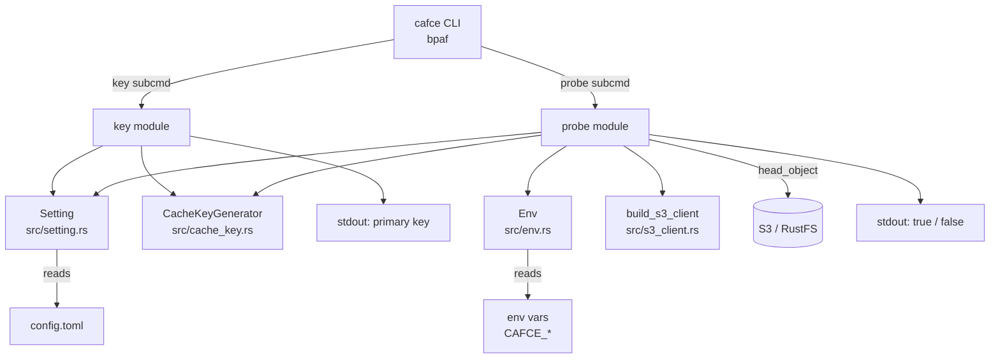

# probe/key サブコマンドと config file 拡張 設計ドキュメント

## 1. Overview (概要)

本ドキュメントは、issue #6「キャッシュキーを計算してS3 APIでファイルの照会をして、キャッシュがあるかどうか判定する機能を追加する」に対応するための設計をまとめたものである。既に #3 でキー計算ロジック（`CacheKeyGenerator`）、#2 で S3 クライアント構築（`build_s3_client`）が実装済みであることを前提に、これらを繋いで cafce の CLI として利用可能にする。

具体的には、TOML 形式の config file をキャッシュ設定の中心的な情報源として位置づけ、`key` サブコマンド（config を元にキャッシュキーを計算して出力）と `probe` サブコマンド（キャッシュキーに対応するオブジェクトが S3 上に存在するかを判定）を追加する。加えて、複数リポジトリで同一バケットを相乗り利用することを見据えた S3 オブジェクトキーのレイアウトを確定する。

本フェーズでは実際のキャッシュ本体の格納・取得は行わない（#7 の担当）。あくまで「キー計算」と「存在判定」という、副作用が read-only な機能に閉じることで、後続の #7 に安全な基盤を提供することを目的とする。

## 2. Context (背景)

現状の cafce は以下の状態にある：

- `src/cache_key.rs` にキー計算ロジックが揃っている（#3 マージ済み）
- `src/s3_client.rs` に S3 クライアント構築が揃っている（#2 マージ済み）
- `src/setting.rs` に config 構造体と TOML I/O の仮組みが存在するが、単体テストが無く、フィールドが private で外部から利用できない
- `src/main.rs` の `Store`/`Restore` は `println!` のみで実処理を持たない
- `key`/`probe` サブコマンド、および `-h`/`--help` の英語対応は未実装
- S3 上のオブジェクトキーのレイアウト（bucket をどこで持つか、prefix・project 名前空間をどう構成するか）は未決定
- `Env` / `s3_client` モジュールが `lib.rs` に公開されておらず、統合テスト（`tests/` 配下）から利用できない（#2 の申し送り）

一方で issue #6 の完了定義には、config file フォーマットの確定、`key`/`probe` の実装、`-h`/`--help` 対応、標準出力の日本語ドキュメント化、単体テスト・rustfs 宛統合テストの実装、が含まれている。これらを一括で満たすための設計判断をここでまとめる。

fallback キャッシュ（キー未ヒット時に代替キーを試す機構）については GitLab CI と GitHub Actions で意味論が大きく異なる。cafce としてはどちらに寄せるかを本ドキュメントで確定するが、実際の解決処理は #7 の `restore` 実装と一体で扱うため、本フェーズでは配線しない。

## 3. Scope (範囲)

### 変更対象ファイル

| ファイル | 役割 |
|---|---|
| `src/setting.rs` | `Setting` 構造体を確定させる（`project` フィールド追加、フィールド公開、`thiserror` 化、単体テスト追加） |
| `src/env.rs` | `CAFCE_AWS_BUCKET`（必須）、`CAFCE_S3_PREFIX`（任意）フィールドを追加 |
| `src/lib.rs` | `env` / `s3_client` を `pub mod` として公開（統合テストから利用可能にする） |
| `src/main.rs` | `key` / `probe` サブコマンドを追加。既存の `Store` / `Restore` は #6 スコープ外だが、`-h`/`--help` の英語文言と bpaf 定義の整理は行う |
| `Cargo.toml` | 依存追加は原則不要（変数展開は自前実装、S3 head_object は既存 `aws-sdk-s3` で対応） |
| `README.md` | 新規 env 変数と TOML フォーマット、`key`/`probe` の使い方を追記 |

### 新規追加ファイル

| ファイル | 役割 |
|---|---|
| `src/probe.rs` | `probe` サブコマンドのロジック（S3 head_object を用いた存在判定） |
| `src/subcommand/` 相当 or `main.rs` 内関数 | `key` サブコマンドのロジック配置場所は実装時に決める |
| `doc/feature/display_logs.md` | cafce の各サブコマンドが標準出力・標準エラー出力に出すメッセージの日本語仕様書 |
| `tests/probe_integration.rs`（仮称） | rustfs 宛の `probe` 統合テスト（`docker-compose up -d` された前提で動作） |

### 変更対象外

| ファイル | 理由 |
|---|---|
| `src/cache_key.rs` / `src/file_matcher.rs` / `src/hash_calculator.rs` | #3 で確定済み。挙動を維持する |
| `src/s3_client.rs` | #2 で確定済み。`build_s3_client` の API を変更しない |
| `src/error.rs` | 既存の `CacheKeyError` は維持。probe/setting 固有のエラーは各モジュール内で定義する |

## 4. Goal (目標)

- **config file フォーマットの確定**: TOML 形式で `project` を必須、`key`（literal String または `{files, prefix}`）を必須、`paths` / `fallback_keys` は #7 のために予約フィールドとして受け入れる
  成功指標: `Setting::new_from_file` が typed error でパースエラーを返し、単体テストで round-trip・パース失敗ケースをカバーできること

- **`key` サブコマンドの実装**: config file を読み、CWD を base_path として `CacheKeyGenerator::generate_key` を呼び、結果を stdout に 1 行で出力する
  成功指標: 同一の config・同一のファイル内容に対して同じキー文字列が出力されること（#3 の regression テストと整合）

- **`probe` サブコマンドの実装**: `key` と同じ経路でキーを計算し、`{prefix?}/{project}/{cache_key}` のオブジェクトキーで `head_object` を発行、存在時 `true`、404 時 `false` を stdout に出力する
  成功指標: rustfs 統合テストで、事前に `put_object` した場合は `true`、していない場合は `false` を返すこと

- **CLI 全体の `-h`/`--help` 英語対応**: bpaf の doc comment / `help` 属性でトップレベルおよび各サブコマンド（既存の `Store`/`Restore`/`Init` を含む）の説明を英語で提供する
  成功指標: `cafce --help` および各 `cafce <subcmd> --help` が英語のヘルプを出力すること

- **標準出力の日本語ドキュメント化**: `doc/feature/display_logs.md` に、各サブコマンドが正常系・異常系で何を stdout / stderr に出すかを日本語で列挙する
  成功指標: `key` / `probe` について、正常出力・想定エラー出力の全パターンが列挙されていること

- **単体テストと rustfs 統合テスト**: `setting.rs` の TOML パース、`env.rs` の bucket/prefix 読み取り、`probe.rs` のオブジェクトキー組み立てを単体テストで、rustfs に対する hit/miss ケースを統合テストでカバーする
  成功指標: `cargo test` で全テストが通り、`docker compose up -d` 済み環境で統合テストが hit/miss 両方通ること

## 5. Non-Goal (目標外)

- **キャッシュ本体の格納・取得**: `store` / `restore` の実装は #7 で扱う。cafce 本体には payload を S3 に置く/取ってくる機能はまだ入らない

- **fallback_keys の解決処理**: config には書けるが #6 では読み捨てる。`probe` は primary のみを対象にする。fallback を実際に順に試すロジックは #7 の `restore` で実装

- **圧縮形式・オブジェクトの metadata 仕様**: 本体格納が #7 スコープなので、metadata の設計もそちらに委ねる

- **認証機構の変更**: `build_s3_client` の API はそのまま使う。#9（`aws login` / `aws sso login`）は別枠

- **CI predefined env 変数からの `project` 自動導出**: local 実行時の挙動が複雑化し、GitHub Actions の PR-from-fork では自動分離も完全ではないため、config 必須で確定する

## 6. Solution / Technical Architecture (解決策 / 技術アーキテクチャ)

### 6.1 全体像



### 6.2 config file フォーマット（TOML）

```toml
# 必須: プロジェクト名前空間。S3 オブジェクトキーの一部になる
project = "my-app"

# 必須: 単一の literal 文字列 or { files, prefix } の 2 形態を受け付ける
key = "static-key"
# または
[key]
files = ["Cargo.lock", "package.json"]
prefix = "deps-v1"  # 任意

# #6 では受け付けるが未使用（#7 で restore に配線）
fallback_keys = []

# #6 では受け付けるが未使用（#7 で store/restore の圧縮対象として使う）
paths = []
```

- `project` は必須。未指定または空文字は typed error で拒否
- `key` は `StringOrStruct<Key>` 型で literal / files-based の両形態を許容（既存構造を踏襲）
- `paths` / `fallback_keys` は #6 では未使用。パースは通すが読み捨てる。空配列がデフォルト
- 未知のキーは serde のデフォルト挙動に任せる（無視 or 厳格チェックのどちらにするかは実装時に決定するが、typed error に載せられるよう `#[serde(deny_unknown_fields)]` を検討）

### 6.3 環境変数

| 変数 | 必須 | 用途 |
|---|---|---|
| `CAFCE_AWS_BUCKET` | ✅ | キャッシュを置く S3 バケット名 |
| `CAFCE_S3_PREFIX` | — | S3 オブジェクトキーの先頭に付ける任意の prefix（末尾スラッシュは正規化） |
| `CAFCE_AWS_*` (既存) | 状況により | エンドポイント・リージョン・認証情報等（#2 で定義済み） |

### 6.4 S3 オブジェクトキーのレイアウト

```
{bucket}/{prefix?}/{project}/{cache_key}
```

- `{bucket}`: `CAFCE_AWS_BUCKET`
- `{prefix?}`: `CAFCE_S3_PREFIX` が指定されていれば挿入、なければ省略
- `{project}`: `Setting.project`
- `{cache_key}`: `CacheKeyGenerator::generate_key` の戻り値

**設計意図**:
- bucket はインフラ（AWS アカウント）依存なので env
- prefix は運用ポリシー依存なので env
- project は repo 依存なので config
- cache_key は入力ファイル依存なので計算値

複数リポジトリで同一バケットを相乗り利用しても、`{project}` セグメントで名前空間が分離される。

### 6.5 サブコマンド仕様

#### `cafce key <config>`
- config file を読む
- CWD を `base_path` として `CacheKeyGenerator::generate_key` を呼ぶ
- 成功時: primary key を stdout に 1 行で出力（改行含む）、exit code 0
- 失敗時（`AbsolutePathNotAllowed` / `NoFilesMatched` / config パース失敗）: stderr にエラー、exit code 非 0

#### `cafce probe <config>`
- `key` と同じ経路でキーを計算
- `Env::new()` で bucket / prefix を読む
- `build_s3_client` で S3 クライアントを構築
- `{prefix?}/{project}/{cache_key}` のオブジェクトキーで `head_object` を発行
  - 200 → stdout `true`、exit code 0
  - 404 (NoSuchKey / NotFound) → stdout `false`、exit code 0
  - その他のエラー（認証失敗、ネットワークエラー等） → stderr にエラー、exit code 非 0
- **primary key のみを対象にする**。`fallback_keys` は #6 では参照しない

#### 未対応サブコマンド
- bpaf の標準動作（unknown command → usage 表示 + 非 0 終了）でエラーになれば要件を満たす

#### `-h`/`--help`
- トップレベルと各サブコマンドに英語の doc comment / `help` 属性を付与
- bpaf の `#[bpaf(options)]` / `#[bpaf(command)]` に対する `/// ...` doc コメントで実装できる

### 6.6 変数展開

**採用構文**: `${VAR}` のみ

- `$VAR`（波括弧なし）はサポートしない（ambiguity 回避）
- `\${VAR}` によるエスケープは要件が出てから検討（#6 スコープでは未実装）
- 展開対象は全 env 変数（cafce が特定の変数名だけ拾うのではなく、`std::env::var` で解決）
- 未定義変数への参照はエラー（silent に空文字にはしない）

**適用箇所**（実装は #7 と共に）:
- `Setting.fallback_keys` の各要素
- `Setting.key`（literal String 形態）と `Setting.key.prefix` に適用するかは open（Concerns 参照）

**#6 での配線**: fallback_keys 自体を使わないため、変数展開ロジックの実装も #7 に持ち越す。ただし本ドキュメントで syntax を確定させておくことで、#7 開始時の議論を省略する。

### 6.7 GitLab / GitHub Actions からの参照点

fallback キャッシュの意味論は GitLab CI に寄せる：

| 項目 | 選択 | 根拠 |
|---|---|---|
| マッチ方式 | 完全一致列挙（GitLab 流） | `probe`（および将来の `restore`）で `head_object` のみで済み、`list_objects_v2` を要さない |
| 変数展開 | 全 env 変数、`${VAR}` 構文 | 完全一致だとブランチ別 fallback を書くのに変数展開が必須。GitLab は変数展開をサポートしている |
| 選択順序 | 順序指定通りに順次試行（GitLab 流） | GitHub Actions の「LastModified 最新」は S3 側で list_objects_v2 + sort が必要でコストが高い |

### 6.8 `lib.rs` の公開範囲拡張

現状 `env` / `s3_client` は `main.rs` からのみ `mod` されている。#6 の統合テスト（`tests/` 配下）で `probe` のロジックを再利用するため、`lib.rs` に以下を追加する：

```rust
pub mod env;
pub mod s3_client;
// 既存
pub mod error;
pub mod file_matcher;
pub mod hash_calculator;
pub mod cache_key;
pub mod setting;
// 新規
pub mod probe;
```

### 6.9 `doc/feature/display_logs.md` の構成方針

- 見出しは `## key サブコマンド` / `## probe サブコマンド` のようにサブコマンドごとに切る
- 各サブコマンドで「正常系の stdout」「正常系の stderr（未使用の場合は明記）」「異常系の stderr メッセージ一覧」を列挙
- 日本語で記述（issue #6 完了定義に従う）
- 将来 `store`/`restore` が加わったら本ドキュメントに節を追加していく

## 7. Alternative Solution (代替案)

### 代替案1: bucket 名を config file 側に置く

**Pros**:
- TOML 一本で完結し、env 変数を減らせる

**Cons**:
- bucket は AWS アカウント／実行環境依存であり、repo に依存しない
- CI 環境ごとに bucket を切り替えたいケースで env の方が自然
- 同一 repo を異なる bucket に対して動かすユースケース（本番/検証環境）で config を書き換える必要が生じる

**判断**: 却下。**env 側に置く**。

### 代替案2: `project` 名を CI predefined env 変数から自動導出する

**Pros**:
- fork や rename に自動追従できる（数値 ID を採用すれば rename にも耐性）
- config に書かなくて済む

**Cons**:
- GitLab CI では fork の PR パイプラインが fork 側で走るため自動分離が働くが、**GitHub Actions では PR-from-fork のワークフローが親側で走るため `GITHUB_REPOSITORY_ID` は親の ID になり、自動分離は完全ではない**
- local 実行時に env 変数が存在しないため、いずれにせよ config or CLI flag の fallback が必要になる
- 実装量が増える（GitLab / GitHub の変数名対応、fork 検出、fallback 経路）
- env は容易に上書き可能なので "セキュリティ" の観点でのメリットは無い

**判断**: 却下。**config 必須にする**。実装が単純で挙動が予測しやすく、必要になれば後から env fallback を非破壊的に追加できる。

### 代替案3: `probe` を primary + fallback の OR 判定にする

**Pros**:
- CI ワークフロー側で「キャッシュがあるか」を 1 コマンドで判定できる

**Cons**:
- issue #6 の完了定義「入力ファイルに対してキャッシュキーを計算して S3 上に存在しているか求め、booleanを返す」に反する（primary のみが自然な読み）
- `probe` の意味がぶれる。「キャッシュキー1つに対する存在確認」なのか「複数キーの OR」なのかを利用者側で判別する必要が生じる
- fallback を試すのは `restore` の仕事であり、責務分離の観点から不自然

**判断**: 却下。`probe` は primary のみ。

### 代替案4: fallback_keys を GitHub Actions 流の prefix + LastModified にする

**Pros**:
- 列挙が不要で、`fallback_keys = ["cache-npm-"]` の 1 行で「直近の cache-npm-* を取得」が書ける
- ユーザー体験は良い

**Cons**:
- 実装に `list_objects_v2` と LastModified sort が必要でコスト高
- 権限も `s3:GetObject` に加えて `s3:ListBucket` が必要になる
- #6 の `probe` は primary の存在確認だけなので、この機構の恩恵は #7 の `restore` まで得られない
- GitLab に寄せる決定と統一性が取れない

**判断**: 却下。GitLab 流の完全一致に統一。

### 代替案5: 変数展開の構文で `$VAR` も受け付ける

**Pros**:
- envsubst / shell 準拠で慣れがある
- GitLab も `$VAR` / `${VAR}` を両方受け付けている

**Cons**:
- `$` を literal で含めたいケースが曖昧になる
- 単語区切りの解釈（`$VAR_x` は `${VAR}_x` か `${VAR_x}` か）で混乱を招く

**判断**: 却下。**`${VAR}` のみ**でスタート。必要になったら後から `$VAR` を非破壊的に追加できる（逆は破壊的変更）。

### 代替案6: `Setting.fallback_keys` フィールドを #6 では削除する（YAGNI）

**Pros**:
- 使わないフィールドを config に置かなくて済む
- config file が現時点で使う値だけを持つ、という綺麗さがある

**Cons**:
- 既存の `Setting` からフィールドを削除し、#7 で追加し直すのは無駄な破壊的変更
- 既に `test/sample/setting.toml` に `fallback_keys` があるユーザー（現時点では自分だけだが）に対して壊れる

**判断**: 却下。**フィールドは残す**。パースは通し、値は読み捨てる。

## 8. Concerns (懸念事項)

- **`Setting.fallback_keys` を書けるが動かない期間ができる**（#6 マージ後、#7 マージ前）
  - 緩和策A: `Setting::new_from_file` 内で非空の `fallback_keys` を検出したら stderr に warning を出す
  - 緩和策B: README / display_logs.md に「fallback_keys は #7 で有効化予定」と明記
  - どちらか選ぶ（実装時に決定）

- **`NoFilesMatched` の扱いを GitLab に寄せるか維持するか未確定**
  - GitLab CI の `cache:key:files` は「マッチが 0 件の場合 literal `default` にフォールバックする」
  - cafce 現状（#3 の決定）は「エラーで中断」
  - 「設定ミスと単なる未マッチを区別できるようエラーにする」という #3 の判断は今も有効
  - ただし GitLab 挙動に寄せる方針全体との一貫性は開いた論点
  - 本ドキュメントの範囲外として別途議論する（Work Log に記録予定）

- **`Setting.key` の literal String 形態および `Setting.key.prefix` に `${VAR}` 展開を効かせるか**
  - fallback_keys では必須（ブランチ別 fallback を書くため）
  - primary key の literal / prefix でも同様の需要はある（例: ブランチ別 primary key）
  - #6 では未配線でよいが、#7 での取り扱いを事前に整理しておかないと不整合が生じる
  - 個人的な仮案: 展開対象は「TOML の String 型フィールド全て」だが、`Key.files` の各 glob パターンは展開しない（ファイルパスに `${...}` を書くのは病的なので）

- **`CAFCE_AWS_BUCKET` 未設定時のエラーメッセージ**
  - `Env` パースが `envy::Error` を返すが、bucket は特に必須なので専用のエラーメッセージを付ける方が親切
  - 実装時に thiserror バリアントを追加する

- **`probe` の 404 判定**
  - `aws-sdk-s3` の `head_object` は 404 を `SdkError<HeadObjectError>` の中の `NotFound` バリアントで返す
  - リージョン不一致で 301/400 相当のレスポンスが返ることもあるため、`NotFound` 以外は false にせずエラーとして扱う
  - `HeadObjectError` の網羅的パターンマッチを実装時に確認

- **統合テスト実行の前提条件**
  - `docker compose up -d` で rustfs が起動していること
  - `CAFCE_AWS_SERVER_ADDRESS=localhost:9000` 他が事前に設定されていること
  - CI では #8（GitHub Actions 構築）で回すことになる。#6 では local 実行が通れば十分

## 10. Safety and Reliability (安全性と信頼性)

### テストの実施

- **単体テスト**:
  - `src/setting.rs`: TOML round-trip、必須フィールド欠落時のエラー、`StringOrStruct<Key>` の両形態、未使用フィールド (`paths`/`fallback_keys`) が空でもパース通ること
  - `src/env.rs`: `CAFCE_AWS_BUCKET` の必須チェック、`CAFCE_S3_PREFIX` の任意性、末尾スラッシュの正規化
  - `src/probe.rs`: オブジェクトキーの組み立てロジック（`prefix?/project/cache_key`）を単体でカバー。head_object の呼び出しはモックを使わず、rustfs 統合テストで代替

- **統合テスト**:
  - `tests/probe_integration.rs`（仮称）: rustfs に対して事前 `put_object` した状態で `probe` が `true` を返すこと、していない状態で `false` を返すこと
  - #2 の `s3_client.rs` 内テストにならい、テストごとにユニークな bucket / project 名を使って衝突を避ける
  - 実 AWS 宛の統合テストは #6 では対象外（#2 の疎通確認で AWS 側の権限周りは既に確認済み）

- **エラー経路テスト**:
  - config パース失敗（`project` 欠落、`key` 欠落、絶対パス）
  - env 欠落（`CAFCE_AWS_BUCKET` 未設定）
  - S3 リージョン不一致・認証失敗

### テストカバレッジの計測

- 既存の #3 / #2 と同水準（80% 以上）を目標
- カバレッジ計測ツールの選定は本ドキュメントの範囲外（`cargo-tarpaulin` 等の導入検討は別途）

### 静的型付け言語の採用

- Rust。`setting.rs` のエラー型を `Box<dyn Error>` から `thiserror` の enum に置き換え、typed error として扱う
- `envy::Error` を `Env` パースの thiserror バリアントで包み、`CAFCE_AWS_BUCKET` 未設定を専用バリアントで区別する

## 11. References (参考資料)

- [GitLab CI: cache:fallback_keys](https://docs.gitlab.com/ci/yaml/#cachefallback_keys) — fallback_keys の意味論（完全一致・変数展開・順序）
- [GitLab CI: Caching in GitLab CI/CD](https://docs.gitlab.com/ci/caching) — `CACHE_FALLBACK_KEY` グローバル変数、cache:key:files の未マッチ時挙動
- [GitLab CI: Predefined CI/CD variables](https://docs.gitlab.com/ci/variables/predefined_variables) — `CI_PROJECT_*` 系変数と fork 挙動
- [actions/cache: Caching strategies](https://github.com/actions/cache/blob/main/caching-strategies.md) — restore-keys の prefix マッチ・LastModified sort
- [actions/cache: README (Outputs)](https://github.com/actions/cache/blob/main/README.md) — `cache-hit` output の意味
- [GitHub Actions: Variables reference](https://docs.github.com/en/actions/reference/variables-reference) — `GITHUB_REPOSITORY_ID` 等の fork 挙動
- 既存 Design Doc: `doc/design/20250727_cache_key_files_design.md` — キー計算ロジックの設計（#3）
- 既存 Design Doc: `doc/design/20251231_s3_connect_design.md` — S3 クライアント構築の設計（#2）
- issue #6 / #7 — 本ブランチが対応するタスクと後続タスク

## 12. Work Log (作業ログ)

### 2026-07-21

- 事前確認: #3 でキー計算、#2 で S3 クライアント構築が完了済み。`src/setting.rs` は仮組みされているが単体テストがなく、フィールドが private であるため利用できない状態
- S3 レイアウトの設計判断:
  - bucket 名: env (`CAFCE_AWS_BUCKET`) 必須
  - prefix: env (`CAFCE_S3_PREFIX`) 任意
  - project 名: config (`Setting.project`) 必須
  - cache_key: 計算値
- CI predefined env からの project 自動導出を検討したが、GitHub Actions の PR-from-fork ケースで自動分離が完全に働かないこと、local 実行で fallback が必要になること、env 上書きで簡単に偽装可能でセキュリティ上のメリットが無いことから、config 必須で確定
- fallback_keys の意味論を GitLab CI に寄せる決定（完全一致列挙、変数展開あり、順序試行）
- 変数展開の構文は `${VAR}` のみ採用（`$VAR` は不採用）。展開対象は全 env 変数、未定義変数はエラー
- ただし fallback_keys 自体を #6 では未配線とするため、変数展開の実装は #7 に持ち越し
- 未解決事項として、`NoFilesMatched` の扱いを GitLab 準拠にするか（literal `default` にフォールバック）、現状維持（エラー中断）にするかは、本ドキュメントの範囲外として別途議論
