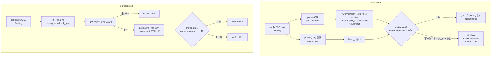

# store/restore サブコマンドとキャッシュ本体の格納・取得 設計ドキュメント

## 1. Overview (概要)

本ドキュメントは、issue #7「キャッシュの格納・取得に対応する」に対応するための設計をまとめたものである。#6 で確定した config file フォーマット・S3 オブジェクトキーレイアウト・キー候補の順序試行（primary → `fallback_keys`）を前提に、これまで `println!` のみだった `store` / `restore` サブコマンドへ実処理を入れる。

具体的には、config file の `paths`（#6 で予約フィールドとして受け入れていた）にキャッシュ対象のファイル/ディレクトリを列挙できるようにし、それを **決定論的な tar アーカイブ + zstd 圧縮** で 1 つの S3 オブジェクトに格納する。同一内容なら実行時刻・実行ホストによらず同じアーカイブ内容になることを保証し、その内容ハッシュ（SHA-256）を S3 の user metadata に記録することで、「キャッシュキーは同じだが中身も同じ」場合の無駄なアップロードを避ける。

加えて、#6 の申し送りで挙がっていたセキュリティ上の問題（`store` / `restore` が `Env` を `Debug` 出力しており、アクセスキー・セッショントークンが CI ログに露出する）を本フェーズで解消する。

## 2. Context (背景)

現状の cafce は以下の状態にある：

- `key` / `probe` は #6 で実装済み。config file（TOML）から primary key を計算し、`{prefix?}/{project}/{cache_key}` のオブジェクトキーで `head_object` による存在判定ができる
- `Setting.paths` は TOML としてパースされるが未使用（#6 時点で「#7 のための予約フィールド」と位置づけられている）
- `store` / `restore` は config と `Env` と `Setting` を `Debug` 出力するだけの仮実装であり、**`CAFCE_AWS_ACCESS_KEY` / `CAFCE_AWS_SECRET_KEY` / `CAFCE_AWS_SESSION_TOKEN` が stdout に出てしまう**（#7 への申し送りとして明示されている既存不具合）
- 圧縮・アーカイブに関する依存 crate は一切入っていない
- S3 オブジェクトに付随するメタデータ（ハッシュ等）の仕様は未定義

一方で cafce の存在意義は「CI ジョブ側で git checkout 後にキャッシュキーを計算する」ことにあり、キー計算だけでは CI から見た価値が閉じない。実際にキャッシュ本体を S3 に置き、次のジョブで取り出せて初めて GitLab CI の `cache:` キーワードの代替になる。

キャッシュ本体を扱うにあたり、以下の 3 点が設計上の焦点になる：

1. **アーカイブの決定論性**: 内容が同じなら常に同じバイト列を得たい。tar は各エントリに mtime・uid/gid・パーミッションを含み、glob の列挙順も環境依存になりうるため、素直に固めると実行のたびに違うバイト列になる
2. **無駄なアップロードの回避**: キャッシュキーが literal String（例: `cache-${CI_COMMIT_REF_SLUG}`）の場合、ブランチが同じである限りキーは変わらないが中身は変わりうる。逆に中身が変わっていないのに毎回アップロードするのは帯域と S3 コストの無駄になる。そのため「キーが同じでも中身が違うなら上書き、中身も同じなら何もしない」判定が要る
3. **展開の安全性**: tar の中身は S3 から降ってくる外部入力である。`../` を含むパスや絶対パスによって作業ディレクトリ外へ書き込まれる（いわゆる zip-slip）ことを防ぐ必要がある

## 3. Scope (範囲)

### 変更対象ファイル

| ファイル | 役割 |
|---|---|
| `src/main.rs` | `store` / `restore` を実処理に接続する。**`println!("{env:#?}")` を含む仮実装を削除する**（資格情報の stdout 露出の解消） |
| `src/env.rs` | `Env` の `#[derive(Debug)]` を外し、資格情報を redact する手書き `Debug` 実装に差し替える |
| `src/setting.rs` | `paths` の意味論を確定させる（glob パターン列、相対パスのみ、`store` では空を許さない）。キー候補列（primary + `fallback_keys`）を返すヘルパを追加し、`probe` / `restore` で共用する |
| `src/probe.rs` | キー候補列の生成を `setting.rs` 側のヘルパへ寄せる。`build_object_key` は `store` / `restore` からも使う |
| `src/error.rs` | アーカイブ・展開・メタデータ検証に関する typed error を追加する |
| `src/lib.rs` | 新規モジュールを公開する |
| `Cargo.toml` | `tar` / `zstd` / `walkdir` を追加。`tempfile` を dev-dependencies から dependencies へ移す |
| `README.md` | `store` / `restore` の説明、`paths` の仕様、必要な IAM 権限（`s3:PutObject` の追加）、S3 metadata 仕様を追記する |
| `doc/feature/display_logs.md` | `store` / `restore` の stdout / stderr 仕様を追記する |

### 新規追加ファイル

| ファイル | 役割 |
|---|---|
| `src/path_matcher.rs` | `Setting.paths` の glob パターンを、アーカイブ対象のエントリ列（ファイル・ディレクトリ・シンボリックリンク）へ解決する。ディレクトリは再帰的に展開する |
| `src/archive.rs` | 決定論的な tar + zstd アーカイブの生成と展開。生成時は tar ストリームの SHA-256 を同時に計算する。ローカル I/O のみで S3 を知らない |
| `src/cache_metadata.rs` | S3 user metadata のキー名定数と、生成・検証（パース）のロジック |
| `src/store.rs` | `store` サブコマンドのロジック（対象解決 → アーカイブ生成 → 既存オブジェクトのハッシュ照合 → 必要時のみ `put_object`） |
| `src/restore.rs` | `restore` サブコマンドのロジック（キー候補の順序試行 → `get_object` → 展開 → 内容ハッシュ検証） |
| `tests/store_restore_integration.rs` | rustfs 宛の `store` / `restore` 統合テスト（`docker compose up -d` 前提、`#[ignore]` 指定） |

### 変更対象外

| ファイル | 理由 |
|---|---|
| `src/s3_client.rs` | #2 で確定済み。`build_s3_client` の API を変更しない |
| `src/cache_key.rs` / `src/file_matcher.rs` / `src/hash_calculator.rs` | #3 / #6 で確定済み。キー計算の挙動は変えない。`paths` の解決に `FileMatcher` は使わない（理由は 6.3 参照） |

## 4. Goal (目標)

- **config file の `paths` 仕様確定**: キャッシュ対象のファイル/ディレクトリを glob パターンで列挙できるようにする。相対パスのみ許可し、作業ディレクトリ外への脱出を拒否する
  成功指標: ファイル・ディレクトリ・ワイルドカードの各形態を単体テストでカバーし、絶対パスと `..` による脱出がエラーになること

- **決定論的な tar + zstd アーカイブ**: 同一内容の入力に対し、実行時刻・実行ホスト・列挙順によらず常に同一バイト列のアーカイブを生成する
  成功指標: 同じ入力で 2 回生成したアーカイブがバイト一致すること、ファイルの mtime だけを変えても一致すること、を単体テストで確認できること

- **S3 metadata のハッシュ仕様確定**: アーカイブ内容の SHA-256 を格納する user metadata のキー名・値形式・スキーマバージョンを定義する
  成功指標: `store` が付与したメタデータを `restore` が解釈でき、未知スキーマバージョンを検出したときに明示的なエラーになること

- **`store` サブコマンドの実装**: 対象を圧縮し、primary key に対応するオブジェクトの metadata ハッシュと照合し、不一致またはオブジェクト不在のときだけアップロードする
  成功指標: rustfs 統合テストで、(a) 初回は `put_object` が走る、(b) 内容を変えずに再実行するとアップロードが省略される（`LastModified` が変わらない）、(c) 内容を変えると上書きされる、が確認できること

- **`restore` サブコマンドの実装**: primary key → `fallback_keys` の順に取得を試み、最初にヒットしたオブジェクトを展開する
  成功指標: rustfs 統合テストで、store → restore のラウンドトリップで元のファイル木が復元され、全 miss のときに `false` を出力して exit 0 になること

- **資格情報の stdout 露出の解消**: `store` / `restore` の `Env` の `Debug` 出力を削除し、`Env` 自体も secret を redact する `Debug` 実装に差し替える
  成功指標: `Env` の `Debug` 出力にアクセスキー・シークレットキー・セッショントークンの値が含まれないことを単体テストで確認できること

## 5. Non-Goal (目標外)

- **マルチパートアップロード**: 単一 `PutObject` の上限である 5 GiB を超えるキャッシュは扱わない。上限超過は明示的なエラーとし、対応は別 issue とする
- **キャッシュの有効期限・世代管理・削除**: TTL、LRU 的な掃除、`cafce clean` 相当は扱わない。ライフサイクルポリシーは S3 側の機能に委ねる
- **GitLab の `cache:policy` 相当（pull / push の切り分け）**: `store` / `restore` をそれぞれ呼ぶかどうかは CI スクリプト側の判断とし、config には持たせない
- **差分アップロード・チャンク分割・コンテンツアドレス格納**: キャッシュは 1 キー 1 オブジェクトの丸ごと置換とする
- **並行実行時の排他制御**: 同一キーへの同時 `store` は last-write-wins とし、ロック機構は入れない
- **暗号化の明示指定（SSE-KMS 等）**: バケット既定の暗号化設定に委ね、cafce からは指定しない
- **ハードリンク・デバイスファイル・FIFO の保存**: ハードリンクは通常ファイルとして重複保存し、特殊ファイルはスキップする

## 6. Solution / Technical Architecture (解決策 / 技術アーキテクチャ)

### 6.1 全体像

`store` と `restore` は S3 とのやり取り（`s3_client` / `probe::build_object_key`）と、ローカルのアーカイブ操作（`path_matcher` / `archive`）を組み合わせる薄い層に留める。アーカイブのロジックは S3 を知らず、S3 の I/O 無しに単体テストできる境界に置く。

### 6.2 config file の拡張（`paths`）

`Setting.paths` は #6 で既にパース対象になっており、TOML の型としての変更は無い。本フェーズで確定させるのはその意味論である。

| 項目 | 仕様 |
|---|---|
| 型 | 文字列の配列（glob パターン）。省略時は空配列 |
| 基準ディレクトリ | カレントディレクトリ（`key.files` と同じ基準） |
| 指定できるもの | ファイル、ディレクトリ、ワイルドカード（`*`, `**`, `?`, `[...]`） |
| ディレクトリ指定 | 再帰的に配下全体を対象にする |
| 絶対パス | エラー（`key.files` と同じ扱い） |
| 基準ディレクトリ外への脱出 | エラー（`../` を含む解決結果を拒否する） |
| `${VAR}` 展開 | **行わない**（#6 で確定済み。ファイルシステムパスは展開対象外） |
| 0 件マッチ | `store` ではエラー。パターン自体は書かれているのに 1 件も無いのは設定ミスか前段のビルド失敗である可能性が高く、空アーカイブを置くと次回以降の `restore` が「ヒットしたのに何も無い」状態になるため |
| `paths` 自体が空配列 | `store` ではエラー。`restore` では参照しない |
| 件数上限 | 設けない（`key.files` の 50 件上限は「キー計算のためのハッシュ対象」に対する制限であり、キャッシュ本体には適用しない） |

`restore` は `paths` を参照しない。アーカイブに何が入っているかはアーカイブ自身が持つ情報であり、展開時に config を再解釈すると `store` 時と `restore` 時で `paths` が食い違ったときに挙動が読めなくなるためである。

### 6.3 キャッシュ対象の解決（`path_matcher`）

`key.files` の解決に使っている `FileMatcher` は再利用しない。理由は次の 3 点で、責務が異なる：

- `FileMatcher` はディレクトリを結果から除外する（ハッシュ計算対象はファイルのみでよい）。`paths` は空ディレクトリも含めてディレクトリ構造を保存する必要がある
- `FileMatcher` は 50 件上限を持つ。キャッシュ本体には不適切
- `FileMatcher` は基準ディレクトリ外のマッチを黙って無視する。`paths` では設定ミスに気づけるようエラーにしたい

`path_matcher` の責務は「glob パターン列 → アーカイブ対象エントリの集合」への変換である。パターンにディレクトリがマッチした場合は `walkdir` で再帰的に配下を列挙し、途中のディレクトリエントリ自体も結果に含める。シンボリックリンクは**辿らずリンクとして保存**する（辿ると同じ実体を重複格納したり、リンク先が基準ディレクトリ外にある場合に想定外のファイルを持ち出すことになる）。結果は重複排除したうえで、基準ディレクトリからの相対パスのバイト列順でソートする。

### 6.4 決定論的アーカイブ（`archive`）

zstd フレーム自体はタイムスタンプを持たないため、非決定性の発生源は tar 側にある。以下の正規化を行う。

| 項目 | 正規化の内容 | 理由 |
|---|---|---|
| エントリ順 | 相対パスのバイト列昇順 | ファイルシステムの列挙順は環境依存 |
| パス表記 | 基準ディレクトリからの相対パス、区切りは `/` に統一 | Windows と Unix でのバイト列一致 |
| mtime | 固定値 `0`（UNIX epoch） | 実行時刻・checkout 時刻への依存を断つ（6.5 も参照） |
| uid / gid | `0` | 実行ユーザー依存を断つ |
| uname / gname | 空文字 | 同上 |
| パーミッション | ファイルは owner の実行ビット有無で `0o755` / `0o644` に丸める。ディレクトリは `0o755` | umask 差による揺れを断ちつつ、実行可能ファイルの実行ビットは保つ |
| tar フォーマット | GNU 形式（長いパスは GNU longname エントリ） | pax 拡張ヘッダに atime/ctime を載せない |
| zstd | 圧縮レベル固定（既定 3）、シングルスレッド、フレームチェックサム有効 | レベル・スレッド数が変われば出力バイト列が変わるため固定する |

生成時は「tar ストリーム → SHA-256 を計算しつつ zstd エンコーダへ流す」という一段のパイプラインにする。アーカイブは一時ファイル（`tempfile`）へ書き出し、そのまま `ByteStream::from_path` でアップロードする。メモリ上に全体を載せない。

展開時は逆順（`get_object` のストリーム → 一時ファイル → zstd デコード → SHA-256 計算しつつ tar 展開）で、以下の安全策を課す：

- エントリのパスが絶対パス、あるいは正規化後に基準ディレクトリの外を指す場合はエラーにする
- シンボリックリンクのリンク先が基準ディレクトリの外を指す場合もエラーにする
- 通常ファイル・ディレクトリ・シンボリックリンク以外のエントリ型はスキップし、`log::warn!` を出す
- 既存ファイルは上書きする（キャッシュ復元の意味論として、既にあるものを残す方が事故になりやすい）

### 6.5 mtime の扱い

アーカイブ内の mtime を固定値にする以上、展開後のファイルの mtime を何にするかを決める必要がある。**展開時刻（現在時刻）を設定する**方針を採る。

理由は cargo や make のような mtime ベースの差分ビルド系との相性である。キャッシュ対象は典型的には `target/` や `~/.cargo` のようなビルド成果物であり、それらの mtime がソースより古いと「ソースの方が新しい」と判定されて全再ビルドが走る。epoch 固定のまま展開すると、キャッシュがヒットしてもビルドが短縮されず、キャッシュの意味が失われる。展開時刻を入れれば、少なくとも「復元直後は成果物の方が新しい」状態になる。

この選択は「アーカイブは決定論的だが、展開結果のファイル属性は復元時刻に依存する」ことを意味する。内容ハッシュ（6.6）は tar ストリーム（正規化済み mtime）に対して計算するため、この非決定性がハッシュ照合に影響することはない。

### 6.6 S3 user metadata の仕様

S3 の user metadata はキーが `x-amz-meta-` 接頭辞付きで送られ、取得時は小文字化されて返る。値は US-ASCII で、全体で 2 KB の上限がある。cafce は以下の 3 つだけを付与する。

| metadata キー（`x-amz-meta-` を除いた名前） | 値の形式 | 意味 |
|---|---|---|
| `cafce-schema-version` | 10 進整数の文字列。本フェーズでは `1` | メタデータおよびアーカイブレイアウトのスキーマ版数 |
| `cafce-archive-format` | `tar+zstd` | ペイロードのアーカイブ形式 |
| `cafce-content-sha256` | 小文字 16 進 64 文字 | **展開後の内容の同一性を表すハッシュ**。zstd 圧縮前の tar ストリーム全体に対する SHA-256 |

`cafce-content-sha256` の対象を「オブジェクト本体（tar.zst のバイト列）」ではなく「圧縮前の tar ストリーム」にするのは、ハッシュを**内容の同一性**の表現にしたいためである。zstd のバージョンやレベルが変われば同じ内容でも本体バイト列は変わるが、tar ストリームは変わらない。CI 群の中に cafce のバージョンが混在していても、内容が同じ限り再アップロードは起きない。転送経路のビット化けは zstd のフレームチェックサムが検出する。

読み取り側の互換性方針：

- `cafce-schema-version` が未知（将来の版数）のオブジェクトを `restore` が引いた場合は、黙って展開せずエラーにする
- メタデータが 1 つも無いオブジェクト（cafce 以外が置いたもの、あるいは `aws s3 cp` で手置きしたもの）は、`restore` では**内容ハッシュ検証をスキップして展開を試みる**。`store` では「ハッシュ不一致」と同じ扱いにして上書きする

### 6.7 `store` サブコマンドの仕様

1. config を読み、カレントディレクトリを基準に primary key を計算する（`fallback_keys` は使わない。書き込み先は常に primary key である）
2. `paths` を解決してアーカイブ対象エントリを得る（空ならエラー）
3. 決定論的アーカイブを一時ファイルへ生成し、tar ストリームの SHA-256 を得る
4. `{prefix?}/{project}/{primary_key}` に対して `head_object` する
   - 存在し、かつ `cafce-content-sha256` が一致 → アップロードせず終了（stdout に `false`）
   - 存在するがハッシュ不一致 / メタデータ欠落 → 5 へ
   - 404 → 5 へ
   - 403 その他 → エラー終了（`probe` と同じく、silent な auth failure を cache miss に見せかけない）
5. `put_object` で 6.6 のメタデータ付きアップロード（stdout に `true`）

`head_object` は `probe` と同じ 404/403 の扱いをするため、判定部分は `probe.rs` の既存関数を metadata も返す形へ拡張して共用する。

### 6.8 `restore` サブコマンドの仕様

1. config を読み、primary key と `fallback_keys` からキー候補列を作る（`probe` と同じ順序・同じ解決経路。`probe` が `true` を返す状況では `restore` も必ずヒットする、という不変条件を保つ）
2. 各候補について `get_object` を発行する
   - `NoSuchKey` → 次の候補へ
   - 403 その他 → エラー終了
   - 成功 → 3 へ（以降の候補は試さない）
3. レスポンスのメタデータからスキーマ版数を検証する
4. ボディを一時ファイルへ落とし、zstd 展開しながら tar をカレントディレクトリへ展開し、同時に tar ストリームの SHA-256 を計算する
5. `cafce-content-sha256` と照合し、不一致ならエラー終了（stdout には何も出さない）
6. 成功なら stdout に `true`。全 miss なら stdout に `false`（exit 0）

存在確認に `head_object` を挟まず `get_object` を直接使うのは、ヒット時のラウンドトリップを 1 回減らせるうえ、必要な IAM 権限が変わらないためである。

ハッシュ不一致は展開後に判明するため、その時点でファイル木は既に書き換わっている。この場合は「作業ディレクトリに中途半端に復元されたファイルが残っている可能性がある」ことを stderr に明示して異常終了する（代替案は 7 節参照）。

### 6.9 stdout の意味論

`probe` の `true` / `false` に揃え、`store` / `restore` も stdout は 2 値のみとする。

| サブコマンド | `true` | `false` |
|---|---|---|
| `probe` | いずれかのキーが存在する | 全 miss |
| `store` | アップロードした | 内容が同一だったのでアップロードしなかった |
| `restore` | 展開した | 全 miss で何もしなかった |

いずれも正常系は exit 0 であり、CI スクリプトからは `$(cafce restore cafce.toml)` を条件分岐に使える。詳細な進捗（対象件数、アーカイブサイズ、選ばれた fallback キー等）は `log::info!` / `log::debug!` で出し、`RUST_LOG` で制御する。stdout には出さない。

### 6.10 資格情報の露出対策

- `main.rs` の `store` / `restore` にある `println!("{config:#?}")` / `println!("{env:#?}")` / `println!("{setting:#?}")` を削除する
- `Env` から `#[derive(Debug)]` を外し、`aws_access_key` / `aws_secret_key` / `aws_session_token` を固定文字列（例: `"***"`）に置き換える手書きの `Debug` 実装に差し替える。値の有無だけは診断のため区別できるようにする（未設定は `None` のまま表示する）
- 単体テストで、`Debug` 出力に実際の secret 文字列が含まれないことを検証する

`Env` の `Debug` を単に削除するのではなく redact 版を残すのは、`#[derive(serde::Deserialize)]` を持つ構造体を `.context()` 等で診断表示したい場面が今後も出るためで、そのたびに `Debug` の有無で悩まないようにするためである。

### 6.11 依存 crate

| crate | 用途 | 備考 |
|---|---|---|
| `tar` | tar の生成・展開 | ヘッダを手で組み立てて正規化する |
| `zstd` | zstd 圧縮・展開 | C の libzstd を同梱ビルドする。ビルドに C コンパイラが要る |
| `walkdir` | ディレクトリの再帰列挙 | シンボリックリンクを辿らない設定で使う |
| `tempfile` | アーカイブの一時ファイル | 現在 dev-dependencies にあるものを dependencies へ移す |

アーカイブのバイト列は zstd のバージョンに依存するため、これらは `=` でパッチバージョンまで完全固定する（プロジェクトの Rust 規約の「依存 crate の semver を信用しない」に沿う）。内容ハッシュは tar ストリームに対して取るので、zstd 更新時に再アップロードが誘発されることはないが、「同じ入力から同じ本体バイト列」という性質を意図せず失わないよう固定しておく。

### 6.12 モジュール境界とエラー型

- `path_matcher` / `archive` / `cache_metadata` はローカル完結。回復不能な設定ミス・破損は `error.rs` に typed error として足し、呼び出し側で `anyhow::Context` を付けて文脈を積む
- `store` / `restore` は `async fn`。`main.rs` の tokio runtime 上で駆動する。アーカイブの生成・展開は同期 I/O だが、CLI として 1 コマンド 1 処理のため `spawn_blocking` は入れない（並行性が無く、ブロックしても他のタスクを妨げない）
- `error.rs` に追加する主なバリアント: `paths` が空 / 0 件マッチ、絶対パス、基準ディレクトリ外への脱出、未知スキーマ版数、内容ハッシュ不一致、アーカイブサイズが単一 PUT の上限超過

## 7. Alternative Solution (代替案)

### 代替案1: 内容ハッシュの対象をオブジェクト本体（tar.zst）にする

**Pros**

- ダウンロード直後、展開前に完全性を検証できる（壊れたアーカイブを展開し始めずに済む）
- `store` 側では、アップロードするバイト列そのもののハッシュなので概念が単純
- ETag（マルチパートでない場合は MD5）との対応関係も分かりやすい

**Cons**

- zstd のバージョン・圧縮レベル・スレッド数が変わると、内容が同じでもハッシュが変わる。cafce のバージョンが混在した CI 群では、ジョブが走るたびに交互に再アップロードが起きうる
- 「キャッシュの中身が同じか」という問いに対して、圧縮方式という無関係な軸が混ざる

**判断**: 不採用。metadata ハッシュの主目的は無駄なアップロードの抑止であり、内容の同一性を表す軸であるべき。転送経路の破損検出は zstd のフレームチェックサムで足りる。

### 代替案2: tar の mtime を実際の値のまま保存する

**Pros**

- 展開後に元の mtime が復元でき、差分ビルド系との相性を考えなくてよい
- 正規化のコードが要らない

**Cons**

- issue #7 の完了定義「圧縮結果が時刻に依存せず冪等であること」を満たさない
- CI では毎回 fresh checkout されるためソースの mtime が実行のたびに変わる。内容が同一でもアーカイブが変わり、毎回再アップロードが発生する（アップロード抑止の仕組みが機能しなくなる）

**判断**: 不採用。ただし「展開時に現在時刻を入れる」（6.5）ことで、差分ビルド系との相性の問題は実用上緩和する。

### 代替案3: `restore` を「一時ディレクトリへ展開 → 検証 → 移動」の 2 段構えにする

**Pros**

- ハッシュ不一致・展開エラー時に、作業ディレクトリを一切汚さない（原子性に近い挙動）

**Cons**

- キャッシュ 1 個分のディスクを追加で消費する（CI ランナーのディスクは潤沢とは限らない）
- 一時ディレクトリと最終配置先が別ファイルシステムだと rename が使えず、結局コピーになって遅い
- 「既存ファイルとマージして復元する」意味論（既にあるファイルは残しつつ上書き）と噛み合わせるのが煩雑になる

**判断**: 不採用。ハッシュ不一致は実際上ほぼ発生せず（発生するなら S3 側の破損か第三者による書き換え）、その稀なケースのために常時のコストを払わない。代わりに、失敗時は「作業ディレクトリが中途半端な状態になっている可能性がある」ことを stderr で明示する。

### 代替案4: `restore` のハッシュ不一致を cache miss として扱い、次の候補キーへ進む

**Pros**

- CI が止まらない。壊れたキャッシュを踏んでもフルビルドにフォールバックできる

**Cons**

- 既に展開してしまったファイルが残っている状態で次の候補を上書き展開することになり、2 つのキャッシュが混ざった木ができる
- キャッシュ破損という異常が可視化されないまま、CI が「なぜか遅い」状態を続けることになる

**判断**: 不採用。異常はフェイルファストで見せる。#6 で 403 を cache miss にしなかったのと同じ判断軸である。

### 代替案5: アーカイブ形式を zip にする

**Pros**

- エントリ単位のランダムアクセスができ、将来的な部分復元の余地がある
- Windows 環境での馴染みがよい

**Cons**

- issue #7 の完了定義が zstd を明示している
- zip はエントリごとに圧縮するため、多数の小ファイル（`~/.cargo/registry` のような）では tar + 単一 zstd ストリームより圧縮率が大きく劣る
- Unix のパーミッション・シンボリックリンクの表現が拡張フィールド依存で、実装差が出やすい

**判断**: 不採用。

### 代替案6: `paths` を config ではなく CLI 引数で受け取る

**Pros**

- ジョブごとにキャッシュ対象を変えたいとき、config を書き分けなくてよい

**Cons**

- issue #7 の完了定義が「config file を拡張してキャッシュ対象を列挙できるようにすること」を求めている
- `key` / `probe` / `store` / `restore` が同じ config を単一の情報源として見る、という #6 で確立した構図が崩れる
- `store` と `restore` で異なる `paths` を渡せてしまい、事故の余地が増える

**判断**: 不採用。

### 代替案7: `store` の重複判定を metadata ハッシュではなく ETag で行う

**Pros**

- メタデータ仕様を定義しなくてよい。`head_object` のレスポンスに必ず入っている

**Cons**

- ETag はマルチパートアップロードや SSE-KMS の下で MD5 と一致しなくなり、計算方法が S3 実装依存になる（S3 互換サーバではさらに差が出る）
- ETag は本体バイト列のハッシュであり、代替案1 と同じく圧縮方式の変化に引きずられる
- issue #7 の完了定義が「S3 metadata にファイルのハッシュ値を格納するための metadata 文字列の仕様が定義されること」を求めている

**判断**: 不採用。

### 代替案8: `paths` が 0 件マッチのときに空アーカイブを置く

**Pros**

- `store` が失敗しないため、CI のジョブが赤くならない
- `cache_key` 側が 0 件マッチで `default` キーにフォールバックする挙動（#6）と形の上では揃う

**Cons**

- 空のキャッシュがヒットする状態が作られ、次回以降の `restore` が `true` を返すのに何も復元されない。原因追跡が難しい
- ビルドが失敗して成果物が生成されなかったケースを、正常なキャッシュとして固定してしまう

**判断**: 不採用。キー計算の 0 件マッチ（GitLab CI 互換のために `default` へ倒す必然性がある）と、キャッシュ本体の 0 件マッチは別問題として扱う。

### 代替案9: `store` で `head_object` を省略し、常に `put_object` する

**Pros**

- 実装が単純。ラウンドトリップが 1 回減る
- S3 は上書き PUT が安いので、内容が同じでも実害は転送量だけ

**Cons**

- issue #7 の完了定義が明示的にハッシュ照合による省略を求めている
- CI の並列度が高い環境では、同一内容のアップロードが人数分走って帯域を食う。セルフホストの S3 互換サーバでは無視できない

**判断**: 不採用。

## 8. Concerns (懸念事項)

- **単一 `PutObject` の 5 GiB 上限**: `target/` 丸ごとのようなキャッシュは容易に GB 級になる。上限を超えた場合、SDK のエラーが分かりにくい形で出る可能性がある
  - 緩和策: アーカイブ生成後にサイズを確認し、上限超過なら「マルチパートアップロード未対応であること」を明示した typed error で落とす
- **一時ファイルのディスク消費**: CI ランナーの `/tmp` が小さい、あるいは tmpfs（メモリ）である場合に失敗しうる
  - 緩和策: 一時ファイルの配置先を `TMPDIR` に従わせる（`tempfile` の既定挙動）。README に記載する
- **mtime 正規化と差分ビルドの相互作用**: 6.5 の方針でも、キャッシュ対象にソースと成果物の両方が含まれる構成では、復元後に両者が同一時刻になり判定が不安定になりうる
  - 緩和策: README で「`paths` にはビルド成果物・依存キャッシュを入れ、リポジトリの作業ツリーそのものは入れない」ことを推奨として明記する
- **クロスプラットフォームでのハッシュ差**: Windows では実行ビットが取得できず、Unix で `0o755` になるファイルが `0o644` になる。同一内容でも OS 間でハッシュが割れる
  - 緩和策: 現状は許容し、README に「異なる OS のランナー間でキャッシュを共有すると再アップロードが起きうる」ことを記載する
- **同一キーへの並行 `store`**: 内容が異なる 2 ジョブが同時に走ると last-write-wins になり、直後の `restore` がどちらを引くか不定になる
  - 緩和策: キャッシュの意味論上、どちらが残っても正しさは損なわれない（次のジョブが再度 `store` する）ため許容する
- **`restore` 中断時の中途半端な木**: ネットワーク断や検証失敗で展開が途中で止まると、作業ディレクトリに一部だけ復元されたファイルが残る
  - 緩和策: 異常終了時にその旨を stderr に明示する。CI 側では失敗ジョブを retry すると再度上書き展開されるため、実用上は収束する
- **S3 互換サーバの user metadata 対応**: rustfs が `PutObject` の user metadata を保持し `HeadObject` / `GetObject` で返すかは実機確認が要る
  - 緩和策: 統合テストで metadata のラウンドトリップを最初に確認する。返らない場合は「メタデータ欠落 = 常に再アップロード」となり、正しさは保たれるが省略が効かないことを記録する
- **`zstd` crate の C 依存**: ビルド時に C コンパイラが必要になり、クロスコンパイル・musl ビルドの難易度が上がる
  - 緩和策: 現状は cafce の配布形態が決まっていないため許容する。問題が出た時点で pure Rust 実装の採用を再検討する
- **シンボリックリンクの持ち出し**: 基準ディレクトリ内のリンクが外を指している場合、アーカイブにはリンクとして入るが、展開時に外への書き込み経路になりうる
  - 緩和策: 展開時にリンク先が基準ディレクトリ外を指すエントリを拒否する（6.4）

## 10. Safety and Reliability (安全性と信頼性)

### テストの実施

**単体テスト（S3 を介さないもの）**

- `path_matcher`: ファイル指定、ディレクトリ指定（再帰）、ワイルドカード、重複排除、ソート順、絶対パス拒否、基準ディレクトリ外への脱出拒否、0 件マッチ、シンボリックリンクを辿らないこと
- `archive`: 同一入力から 2 回生成してバイト一致すること、mtime だけ変えても一致すること、ファイルの列挙順を変えても一致すること、uid/gid/umask の差が出ないこと（正規化されたヘッダ値の確認）、ラウンドトリップ（生成 → 展開）で内容・実行ビット・シンボリックリンク・空ディレクトリが復元されること
- `archive`（展開の安全性）: `../` を含むエントリ、絶対パスのエントリ、外部を指すシンボリックリンクを持つ細工済み tar を拒否すること
- `cache_metadata`: メタデータの生成・パース、未知スキーマ版数の検出、メタデータ欠落時の扱い
- `env`: `Debug` 出力に secret が含まれないこと
- `setting`: `paths` の意味論に関するパース・バリデーション

**統合テスト（rustfs 宛、`#[ignore]` 指定）**

`tests/store_restore_integration.rs` に、`docker compose up -d` 済みの rustfs を前提として以下を置く。既存の `tests/probe_integration.rs` と同じ構成（テストごとに一意なバケットを作り、終了時に削除する）を踏襲する。

- store → probe が `true` → restore で元の木が復元される（ラウンドトリップ）
- 同一内容で store を 2 回実行すると 2 回目はアップロードが省略される（`LastModified` が変わらない）
- 内容を変えて store すると上書きされ、restore が新しい内容を返す
- primary miss・fallback hit のときに fallback のアーカイブが展開される
- 全 miss のときに `restore` が `false` を返し exit 0 になる
- user metadata が rustfs でラウンドトリップすること

**AWS 実機テスト**

`src/s3_client.rs` の `aws_integration_tests` と同じく環境変数駆動で、実 S3 に対する store / restore のラウンドトリップを 1 ケース用意する。ここでのみ検出できる差異（署名、metadata の正規化、リージョン）を拾う。

### テストカバレッジの計測

新規追加する `path_matcher` / `archive` / `cache_metadata` / `store` / `restore` を対象に 80% 以上を目標とする。S3 呼び出しを含む `store` / `restore` は分岐（hit / miss / ハッシュ一致 / 不一致）が中心のため、判定ロジックを S3 I/O から切り離した関数に寄せ、単体テストで分岐を網羅する。

### 静的型付け言語の採用

Rust の型システムを引き続き活用する。特に本フェーズでは以下を型で守る：

- S3 metadata のキー名は定数化し、文字列リテラルの散在を防ぐ
- スキーマ版数・アーカイブ形式は enum ないし定数として扱い、未知値を必ず分岐で扱わせる
- 「基準ディレクトリからの相対パス」と「絶対パス」を取り違えないよう、`path_matcher` の戻り値は相対パスであることを型のドキュメントとテストで固定する

`cargo clippy --tests --examples -- -Dclippy::all` を warning ゼロで通すことを前提とする。

## 11. References (参考資料)

- [Amazon S3 のオブジェクトメタデータ](https://docs.aws.amazon.com/AmazonS3/latest/userguide/UsingMetadata.html) — user metadata のキー形式（`x-amz-meta-`）、小文字化、2 KB 上限
- [Amazon S3 PutObject](https://docs.aws.amazon.com/AmazonS3/latest/API/API_PutObject.html) — 単一 PUT の 5 GiB 上限
- [GitLab CI/CD `cache:paths`](https://docs.gitlab.com/ci/yaml/#cachepaths) — キャッシュ対象の列挙とワイルドカードの意味論。cafce の `paths` の参照元
- [Zstandard Compression Format (RFC 8878)](https://datatracker.ietf.org/doc/html/rfc8878) — フレーム構造とチェックサム。フレームにタイムスタンプが無いこと
- [tar crate](https://docs.rs/tar/) — ヘッダの手組みと展開時のパス検証
- [zstd crate](https://docs.rs/zstd/) — 圧縮レベル・チェックサム・ストリーム API
- [Reproducible Builds: Archive metadata](https://reproducible-builds.org/docs/archives/) — アーカイブの決定論化における正規化項目（順序・mtime・uid/gid・パーミッション）
- [aws-sdk-s3 ByteStream](https://docs.rs/aws-sdk-s3/latest/aws_sdk_s3/primitives/struct.ByteStream.html) — ファイルからのストリーミングアップロード
- `doc/design/20260721_probe_and_key_design.md` — #6 で確定した config フォーマット・オブジェクトキーレイアウト・キー候補の順序試行（作成時点の設計意図の記録）

## 12. Work Log (作業ログ)

### 2026-07-28

- issue #7 とそのコメント（S3 metadata へのハッシュ格納例、`Env` の `Debug` 出力による資格情報露出の申し送り）を読み、本ドキュメントの初版を作成した
- 内容ハッシュの対象を「圧縮前の tar ストリーム」と決めた。cafce のバージョン差（zstd の版数差）で再アップロードが誘発されないことを優先した（代替案1）
- mtime は「アーカイブ内は epoch 固定、展開時は現在時刻」と決めた。決定論性の要件と、cargo/make のような mtime ベースの差分ビルドとの相性の両立を狙った（6.5 / 代替案2）
- `paths` の 0 件マッチ・空配列は `store` のエラーとした。キー計算側の `default` フォールバック（#6）とは別の判断軸として整理した（代替案8）
- `restore` は `head_object` を挟まず `get_object` を直接試行する方針とした。必要な IAM 権限が変わらず、ヒット時のラウンドトリップが減るため
- マルチパートアップロード未対応を Non-Goal とし、5 GiB 超過はアーカイブ生成後にサイズ確認して明示的なエラーにすることとした
